## SQL - Funkcje okna (Window functions) <br> Lab 2

---

**Imiona i nazwiska:** Damian Torbus, Adam Woźny

--- 


Celem ćwiczenia jest zapoznanie się z działaniem funkcji okna (window functions) w SQL, analiza wydajności zapytań i porównanie z rozwiązaniami przy wykorzystaniu "tradycyjnych" konstrukcji SQL

Swoje odpowiedzi wpisuj w miejsca oznaczone jako:

---
> Wyniki: 

```sql
--  ...
```

---

### Ważne/wymagane są komentarze.

Zamieść kod rozwiązania oraz zrzuty ekranu pokazujące wyniki, (dołącz kod rozwiązania w formie tekstowej/źródłowej)

Zwróć uwagę na formatowanie kodu

---

## Oprogramowanie - co jest potrzebne?

Do wykonania ćwiczenia potrzebne jest następujące oprogramowanie:
- MS SQL Server - wersja 2019, 2022
- PostgreSQL - wersja 15/16/17
- SQLite
- Narzędzia do komunikacji z bazą danych
	- SSMS - Microsoft SQL Managment Studio
	- DtataGrip lub DBeaver
-  Przykładowa baza Northwind/Northwind3
	- W wersji dla każdego z wymienionych serwerów

Oprogramowanie dostępne jest na przygotowanej maszynie wirtualnej

## Dokumentacja/Literatura

- Kathi Kellenberger,  Clayton Groom, Ed Pollack, Expert T-SQL Window Functions in SQL Server 2019, Apres 2019
- Itzik Ben-Gan, T-SQL Window Functions: For Data Analysis and Beyond, Microsoft 2020

- Kilka linków do materiałów które mogą być pomocne
	 - [https://learn.microsoft.com/en-us/sql/t-sql/queries/select-over-clause-transact-sql?view=sql-server-ver16](https://learn.microsoft.com/en-us/sql/t-sql/queries/select-over-clause-transact-sql?view=sql-server-ver16)
	- [https://www.sqlservertutorial.net/sql-server-window-functions/](https://www.sqlservertutorial.net/sql-server-window-functions/)
	- [https://www.sqlshack.com/use-window-functions-sql-server/](https://www.sqlshack.com/use-window-functions-sql-server/)
	- [https://www.postgresql.org/docs/current/tutorial-window.html](https://www.postgresql.org/docs/current/tutorial-window.html)
	- [https://www.postgresqltutorial.com/postgresql-window-function/](https://www.postgresqltutorial.com/postgresql-window-function/)
	- [https://www.sqlite.org/windowfunctions.html](https://www.sqlite.org/windowfunctions.html)
	- [https://www.sqlitetutorial.net/sqlite-window-functions/](https://www.sqlitetutorial.net/sqlite-window-functions/)


- W razie potrzeby - opis Ikonek używanych w graficznej prezentacji planu zapytania w SSMS jest tutaj:
	- [https://docs.microsoft.com/en-us/sql/relational-databases/showplan-logical-and-physical-operators-reference](https://docs.microsoft.com/en-us/sql/relational-databases/showplan-logical-and-physical-operators-reference)

## Przygotowanie

Uruchom SSMS
- Skonfiguruj połączenie  z bazą Northwind na lokalnym serwerze MS SQL 

Uruchom DataGrip (lub Dbeaver)
- Skonfiguruj połączenia z bazą Northwind3
	- na lokalnym serwerze MS SQL
	- na lokalnym serwerze PostgreSQL
	- z lokalną bazą SQLite

Można też skorzystać z innych narzędzi klienckich (wg własnego uznania)

Oryginalna baza Northwind jest bardzo mała. Warto zaobserwować działanie na nieco większym zbiorze danych.

Baza Northwind3 zawiera dodatkową tabelę product_history
- 2,2 mln wierszy

Bazę Northwind3 można pobrać z moodle (zakładka - Backupy baz danych)

Można też wygenerować tabelę product_history przy pomocy skryptu

Skrypt dla SQL Srerver

Stwórz tabelę o następującej strukturze:

```sql
create table product_history(
   id int identity(1,1) not null,
   productid int,
   productname varchar(40) not null,
   supplierid int null,
   categoryid int null,
   quantityperunit varchar(20) null,
   unitprice decimal(10,2) null,
   quantity int,
   value decimal(10,2),
   date date,
 constraint pk_product_history primary key clustered
    (id asc )
)
```

Wygeneruj przykładowe dane:

Dla 30000 iteracji, tabela będzie zawierała nieco ponad 2mln wierszy (dostostu ograniczenie do możliwości swojego komputera)

Skrypt dla SQL Srerver

```sql
declare @i int  
set @i = 1  
while @i <= 30000  
begin  
    insert product_history  
    select productid, ProductName, SupplierID, CategoryID,   
         QuantityPerUnit,round(RAND()*unitprice + 10,2),  
         cast(RAND() * productid + 10 as int), 0,  
         dateadd(day, @i, '1940-01-01')  
    from products  
    set @i = @i + 1;  
end;  
  
update product_history  
set value = unitprice * quantity  
where 1=1;
```


Skrypt dla Postgresql

```sql
create table product_history(
   id int generated always as identity not null  
       constraint pkproduct_history
            primary key,
   productid int,
   productname varchar(40) not null,
   supplierid int null,
   categoryid int null,
   quantityperunit varchar(20) null,
   unitprice decimal(10,2) null,
   quantity int,
   value decimal(10,2),
   date date
);
```

Wygeneruj przykładowe dane:

Skrypt dla Postgresql

```sql
do $$  
begin  
  for cnt in 1..30000 loop  
    insert into product_history(productid, productname, supplierid,   
           categoryid, quantityperunit,  
           unitprice, quantity, value, date)  
    select productid, productname, supplierid, categoryid,   
           quantityperunit,  
           round((random()*unitprice + 10)::numeric,2),  
           cast(random() * productid + 10 as int), 0,  
           cast('1940-01-01' as date) + cnt  
    from products;  
  end loop;  
end; $$;  
  
update product_history  
set value = unitprice * quantity  
where 1=1;
```


Wykonaj polecenia: `select count(*) from product_history`,  potwierdzające wykonanie zadania

---
> Wyniki: 

```sql
SELECT COUNT(1) FROM Northwind3.product_history;
-- 2310000
``` 

---

# Zadanie 1

Baza: Northwind, tabela product_history

Napisz polecenie, które zwraca: id pozycji, id produktu, nazwę produktu, id_kategorii, cenę produktu, średnią cenę produktów w kategorii do której należy dany produkt. Wyświetl tylko pozycje (produkty) których cena jest większa niż średnia cena.

W przypadku długiego czasu wykonania ogranicz zbiór wynikowy do kilkuset/kilku tysięcy wierszy

pomocna może być konstrukcja ` with `

```sql
--okno
WITH PRODUCT_PRICES AS
	(SELECT ID
		, PRODUCTID
		, PRODUCTNAME
		, CATEGORYID
		, UNITPRICE
		, AVG(UNITPRICE) OVER (PARTITION BY CATEGORYID) AS AVG_PRICE
		, AVG(UNITPRICE) OVER () AS OVERALL_AVG
	FROM Northwind3.PRODUCT_HISTORY)
SELECT * FROM PRODUCT_PRICES WHERE UNITPRICE > OVERALL_AVG;

-- join
SELECT ID
	, p.CATEGORID
	, p.PRODUCTID
	, p.PRODUCTNAME
	, p.UNITPRICE
	, q.AVG_PRICE
FROM Northwind3.PRODUCT_HISTORY p
INNER JOIN (SELECT CATEGORYID, AVG(UNITPRICE) AS AVG_PRICE
			FROM Northwind3.PRODUCT_HISTORY
			GROUP BY CATEGORYID) q
	ON p.CATEGORYID = q.CATEGORYID
WHERE p.UNITPRICE > (SELECT AVG(UNITPRICE) 
						FROM Northwind3.PRODUCT_HISTORY);

-- pozapytanie
SELECT ID
	, CATEGORYID
	, p.PRODUCTID
	, p.PRODUCTNAME
	, p.UNITPRICE
	, (SELECT AVG(UNITPRICE) 
		FROM Northwind3.PRODUCT_HISTORY q 
		WHERE q.CATEGORYID = p.CATEGORYID) AS AVG_PRICE
FROM Northwind3.PRODUCT_HISTORY p
WHERE p.UNITPRICE > (SELECT AVG(UNITPRICE) 
						FROM Northwind3.PRODUCT_HISTORY);
```

Napisz polecenie z wykorzystaniem podzapytania, join'a oraz funkcji okna. Porównaj zapytania. Porównaj czasy oraz plany wykonania zapytań.

Przetestuj działanie w różnych SZBD (MS SQL Server, PostgreSql, SQLite)

## Wyniki PostgreSQL - wyniki limitowane do 500 
1) z funckją okna
   - Czas wykonania 3s
   - 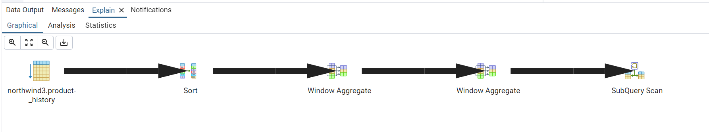
2) z podzapytaniem
   - Czas wykonanie 71s
   - 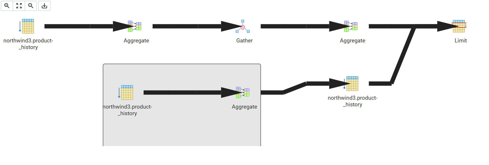
3) z joinem 
   - Czas wykonanie 0.5s
   - 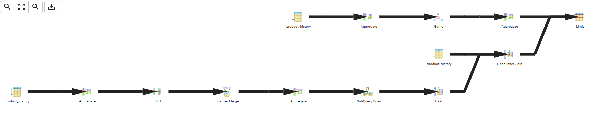

## Wyniki MsSQL 
1) z funckją okna
   - Czas wykonania 2.8s
   - 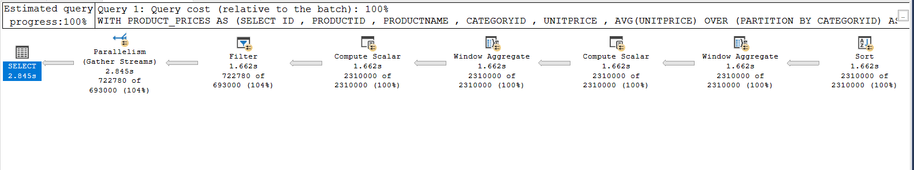
2) z podzapytaniem
   - Czas wykonanie 6s
   - 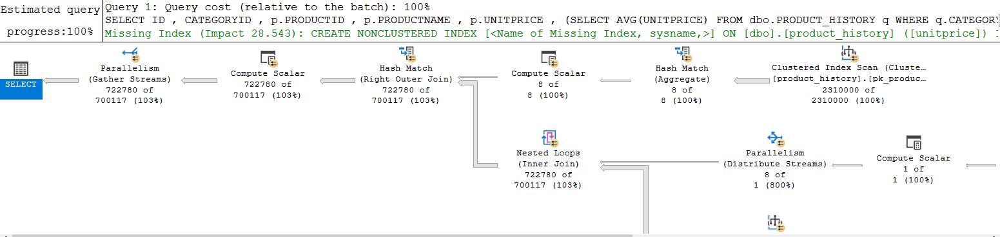
3) z joinem 
   - Czas wykonanie 2s
   - 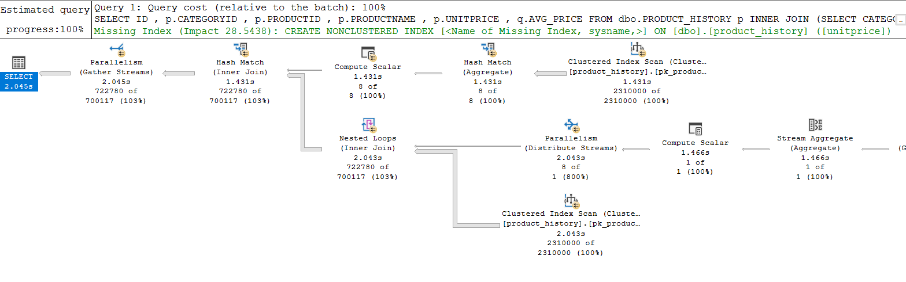

---
> Wyniki: 

```sql

```

---


# Zadanie 2

Baza: Northwind, tabela product_history

Lekka modyfikacja poprzedniego zadania

Napisz polecenie, które zwraca: id pozycji, id produktu, datę, nazwę produktu, id_kategorii, cenę produktu oraz
-  średnią cenę produktów w kategorii do której należy dany produkt.
-  łączną wartość sprzedaży produktów danej kategorii (suma dla pola value)
-  średnią cenę danego produktu w roku którego dotyczy dana pozycja
-  łączną wartość sprzedaży produktu w roku którego dotyczy dana pozycja (suma dla pola value)

Napisz polecenie z wykorzystaniem podzapytania, join'a oraz funkcji okna. Porównaj zapytania. W przypadku funkcji okna spróbuj użyć klauzuli WINDOW.

Podobnie jak poprzednio, w przypadku długiego czasu wykonania ogranicz zbiór wynikowy do kilkuset/kilku tysięcy wierszy

Porównaj czasy oraz plany wykonania zapytań.

Przetestuj działanie w różnych SZBD (MS SQL Server, PostgreSql, SQLite)


---
> Wyniki: 

```sql
-- funkcje okna
SELECT ID
  , PRODUCTID
  , DATE
  , PRODUCTNAME
  , CATEGORYID
  , UNITPRICE
  , AVG(UNITPRICE) OVER category_win AS AVG_CATEGORY
  , SUM(VALUE) OVER category_win AS SUM_CATEGORY
  , AVG(UNITPRICE) OVER year_win AS AVG_YEAR
  , SUM(VALUE) OVER year_win AS SUM_YEAR
FROM Northwind3.PRODUCT_HISTORY
WINDOW category_win AS (PARTITION BY CATEGORYID),
       year_win AS (PARTITION BY DATE_PART('Year', DATE));

-- podzapytanie       
SELECT ID
  , p.PRODUCTID
  , p.DATE
  , p.PRODUCTNAME
  , p.CATEGORYID
  , p.UNITPRICE
  , (SELECT AVG(UNITPRICE) WHERE CATEGORYID = p.CATEGORYID) AS AVG_CATEGORY
  , (SELECT SUM(VALUE) WHERE CATEGORYID = p.CATEGORYID) AS SUM_CATEGORY
  , (SELECT AVG(UNITPRICE) WHERE DATE_PART('Year', DATE) = DATE_PART('Year', p.DATE)) AS AVG_DATE
  , (SELECT SUM(VALUE) WHERE DATE_PART('Year', DATE) = DATE_PART('Year', p.DATE)) AS SUM_DATE
FROM Northwind3.PRODUCT_HISTORY p;

-- join
SELECT ID
  , p.PRODUCTID
  , p.DATE
  , p.PRODUCTNAME
  , p.CATEGORYID
  , p.UNITPRICE
  , c.AVG_CATEGORY
  , c.SUM_CATEGORY
  , y.SUM_YEAR
  , y.AVG_YEAR
FROM Northwind3.PRODUCT_HISTORY p
INNER JOIN (SELECT  CATEGORYID
                  , AVG(UNITPRICE) AS AVG_CATEGORY
                  , SUM(VALUE) AS SUM_CATEGORY
                FROM Northwind3.PRODUCT_HISTORY
                GROUP BY CATEGORYID) c
ON c.CATEGORYID = p.CATEGORYID
INNER JOIN (SELECT  DATE_PART('Year', DATE) AS YEAR
                  , AVG(UNITPRICE) AS AVG_YEAR
                  , SUM(VALUE) AS SUM_YEAR
                FROM Northwind3.PRODUCT_HISTORY
                GROUP BY DATE_PART('Year', DATE)) y
ON DATE_PART('Year', p.DATE) = y.YEAR;

      


```
## Wyniki PostgreSQL - wyniki limitowane do 500 
1) z funckją okna
   - Czas wykonania 5.5s
   - 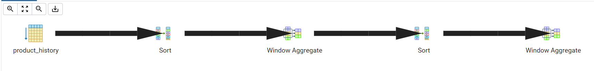
2) z podzapytaniem
   - Czas wykonanie 71s
   - 
3) z joinem 
   - Czas wykonanie 1s
   - 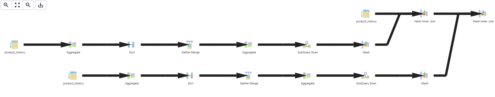

## Wyniki MsSQL - wyniki limitowane do 50tys
1) z funckją okna
   - Czas wykonania 1s
   - 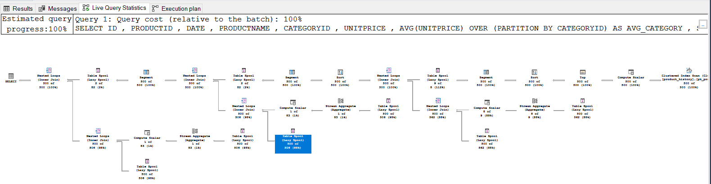
2) z podzapytaniem
   - Czas wykonanie 9.2s
   - 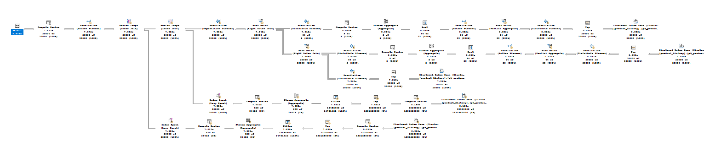
3) z joinem 
   - Czas wykonanie 345ms
   - 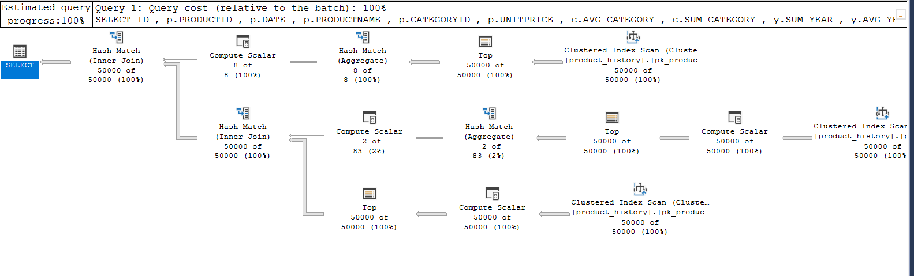


---


# Zadanie 3 

Funkcje rankingu, `row_number()`, `rank()`, `dense_rank()`

Wykonaj polecenie, zaobserwuj wynik. Porównaj funkcje row_number(), rank(), dense_rank().  Skomentuj wyniki.

```sql 
select productid, productname, unitprice, categoryid,  
    row_number() over(partition by categoryid order by unitprice desc) as rowno,  
    rank() over(partition by categoryid order by unitprice desc) as rankprice,  
    dense_rank() over(partition by categoryid order by unitprice desc) as denserankprice  
from products;
```

---
> Wyniki: 

```sql
--  ...
```

---

Zadanie

Spróbuj uzyskać ten sam wynik bez użycia funkcji okna

---
> Wyniki: 

```sql
--  ...
```


---
# Zadanie 4

Baza: Northwind, tabela product_history

Dla każdego produktu, podaj 4 najwyższe ceny tego produktu w danym roku. Zbiór wynikowy powinien zawierać:
- rok
- id produktu
- nazwę produktu
- cenę
- datę (datę uzyskania przez produkt takiej ceny)
- pozycję w rankingu

Uporządkuj wynik wg roku, nr produktu, pozycji w rankingu

---
> Wyniki: 

```sql
WITH A AS 
(SELECT DATE_PART('Year', DATE)
  , ID
  , PRODUCTNAME
  , UNITPRICE
  , RANK() OVER (PARTITION BY ID, DATE_PART('Year', DATE) ORDER BY UNITPRICE DESC) AS R
  FROM Northwind3.PRODUCT_HISTORY
)
SELECT * FROM A 
WHERE R < 5;

-- bez okna
SELECT ID
  , PRODUCTNAME
  , UNITPRICE
  , YEAR
  , RANKING
FROM (
  SELECT DATE_PART('Year', ph.DATE) AS YEAR
    , ph.ID,
    , ph.PRODUCTNAME,
    , ph.UNITPRICE,
    (
      SELECT COUNT(DISTINCT ph2.UNITPRICE)
      FROM Northwind3.PRODUCT_HISTORY ph2
      	WHERE ph2.ID = ph.ID
        AND DATE_PART('Year', ph2.DATE) = DATE_PART('Year', ph.DATE)
        AND ph2.UNITPRICE > ph.UNITPRICE
    ) + 1 AS RANKING
  FROM Northwind3.PRODUCT_HISTORY ph
) AS ranked
WHERE RANKING <= 4
ORDER BY YEAR, ID, RANKING;
```

---

Spróbuj uzyskać ten sam wynik bez użycia funkcji okna, porównaj wyniki, czasy i plany zapytań. Przetestuj działanie w różnych SZBD (MS SQL Server, PostgreSql, SQLite)


---
> Wyniki: 

```sql
--  ...
```
## Wyniki PostgreSQL  
1) z funckją okna
   - Czas wykonania 2.1s
   - 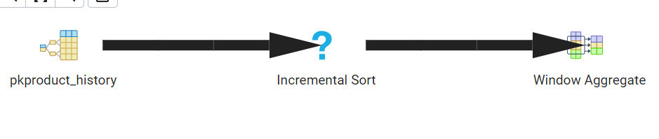
2) bez funkcji okna
   - Czas wykonanie 9.5s
   - 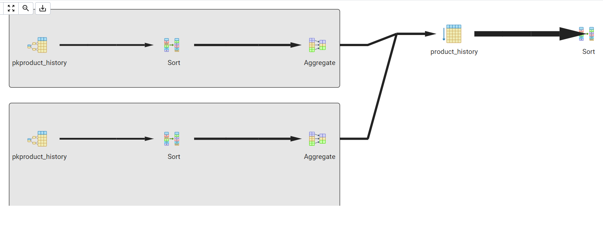

## Wyniki MsSQL  
1) z funckją okna
   - Czas wykonania 11.2s
   - 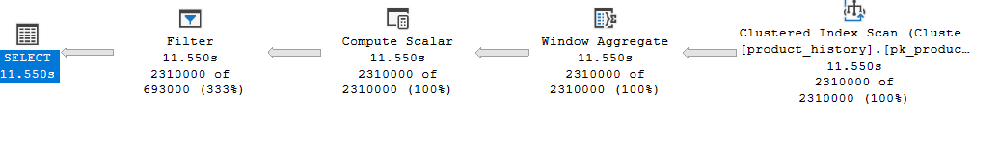
2) bez funkcji okna
   - Czas wykonanie 13.8s
   - 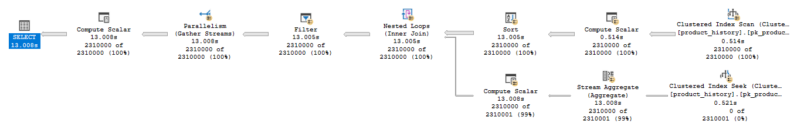

---


# Zadanie 5 

Funkcje `lag()`, `lead()`

Wykonaj polecenia, zaobserwuj wynik. Jak działają funkcje `lag()`, `lead()`

```sql
select productid, productname, categoryid, date, unitprice,  
       lag(unitprice) over (partition by productid order by date)   
as previousprodprice,  
       lead(unitprice) over (partition by productid order by date)   
as nextprodprice  
from product_history  
where productid = 1 and year(date) = 2022  
order by date;  
  
with t as (select productid, productname, categoryid, date, unitprice,  
                  lag(unitprice) over (partition by productid   
order by date) as previousprodprice,  
                  lead(unitprice) over (partition by productid   
order by date) as nextprodprice  
           from product_history  
           )  
select * from t  
where productid = 1 and year(date) = 2022  
order by date;
```

---
> Wyniki: 

```sql
--  ...
```

---

Zadanie

Spróbuj uzyskać ten sam wynik bez użycia funkcji okna, porównaj wyniki, czasy i plany zapytań. Przetestuj działanie w różnych SZBD (MS SQL Server, PostgreSql, SQLite)

---
> Wyniki: 

```sql
--  ...
```

---


# Zadanie 6

Baza: Northwind, tabele customers, orders, order details

Napisz polecenie które wyświetla inf. o zamówieniach

Zbiór wynikowy powinien zawierać:
- nazwę klienta, nr zamówienia,
- datę zamówienia,
- wartość zamówienia (wraz z opłatą za przesyłkę),
- nr poprzedniego zamówienia danego klienta,
- datę poprzedniego zamówienia danego klienta,
- wartość poprzedniego zamówienia danego klienta.

---
> Wyniki: 

```sql
SELECT COMPANYNAME
  , DATE_PART('Year', ORDERDATE)
  , FREIGHT + (UNITPRICE * QUANTITY) * (1 - DISCOUNT) AS PRICE
  , LAG(o.ORDERID) OVER win
  , LAG(o.ORDERDATE) OVER win
  , LAG(FREIGHT + (UNITPRICE * QUANTITY) * (1 - DISCOUNT)) OVER win
FROM Northwind3.ORDERS o
INNER JOIN Northwind3.ORDERDETAILS od
ON o.ORDERID = od.ORDERID
INNER JOIN NOrthwind3.CUSTOMERS c
ON c.CUSTOMERID = o.CUSTOMERID
WINDOW win as (PARTITION BY o.CUSTOMERID);

```

---


# Zadanie 7 

Funkcje `first_value()`, `last_value()`

Baza: Northwind, tabele customers, orders, order details

Wykonaj polecenia, zaobserwuj wynik. Jak działają funkcje `first_value()`, `last_value()`. Skomentuj uzyskane wyniki. Czy funkcja `first_value` pokazuje w tym przypadku najdroższy produkt w danej kategorii, czy funkcja `last_value()` pokazuje najtańszy produkt? Co jest przyczyną takiego działania funkcji `last_value`. Co trzeba zmienić żeby funkcja last_value pokazywała najtańszy produkt w danej kategorii

```sql
select productid, productname, unitprice, categoryid,  
    first_value(productname) over (partition by categoryid   
order by unitprice desc) first,  
    last_value(productname) over (partition by categoryid   
order by unitprice desc) last  
from products  
order by categoryid, unitprice desc;

SELECT 
    p.productid,
    p.productname,
    p.unitprice,
    p.categoryid,
    (SELECT p2.productname 
     FROM Northwind3.products p2 
     WHERE p2.categoryid = p.categoryid 
     ORDER BY p2.unitprice DESC
     LIMIT 1) AS first,
    (SELECT p2.productname 
     FROM Northwind3.products p2 
     WHERE p2.categoryid = p.categoryid 
     ORDER BY p2.unitprice ASC
     LIMIT 1) AS last
FROM Northwind3.products p
ORDER BY p.categoryid, p.unitprice DESC;
```

---
> Wyniki: 

W zwróconym wyniku dla każdego rekordu zwracana jest najwieksza cena w danej kategorii, ale nie najmniejsza, ponieważ jak jest używana klauzula _ORDER BY_ to domyślny zakres okna jest od pierwszego rekordu do tego w którym jest rekord którego dotyczy, tak więc jak posortujumy rosnąco to ta największa wartość znajdzie się w każdym oknie, ale najmniejsza już niekoniecznie (albo prawie na pewno nie jeśli nie mówimy o najtanszym produkcie z kategorii). Podsumowując dane zapytanie zwraca zawsze najdrozszy produkt w danej kategorii i zwykle siebie jako najtanszy (zwykle, bo moze być kilka o tej samej cenie)
```sql
--  ...
```
## Wyniki MsSQL  
1) z funckją okna
   - Czas wykonania 61ms
   - 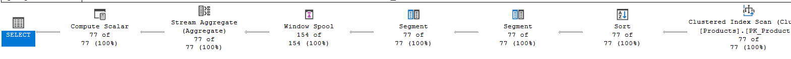
2) bez funkcji okna
   - Czas wykonanie 78ms
   - 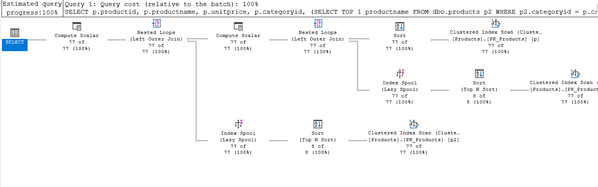

## Wyniki PostgreSQL  
1) z funckją okna
   - Czas wykonania 111ms
   - 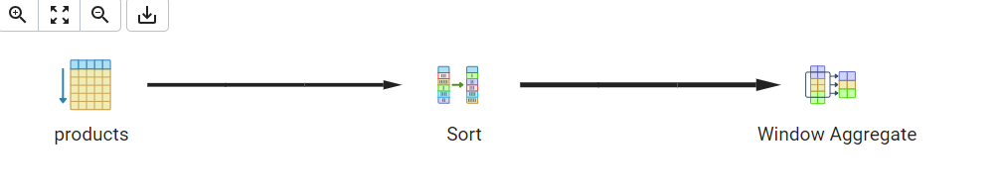
2) bez funkcji okna
   - Czas wykonanie 68ms
   - 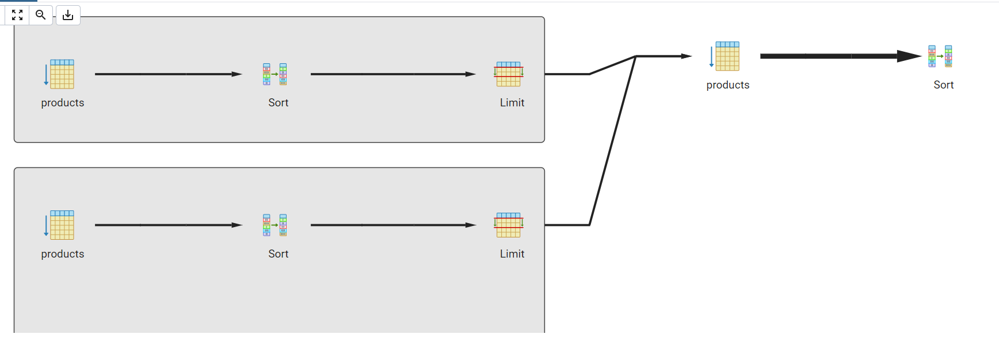
---

Zadanie

Spróbuj uzyskać ten sam wynik bez użycia funkcji okna, porównaj wyniki, czasy i plany zapytań. Przetestuj działanie w różnych SZBD (MS SQL Server, PostgreSql, SQLite)

---
> Wyniki: 

```sql

```

---


# Zadanie 8

Baza: Northwind, tabele orders, order details

Napisz polecenie które wyświetla inf. o zamówieniach

Zbiór wynikowy powinien zawierać:
- Id klienta,
- nr zamówienia,
- datę zamówienia,
- wartość zamówienia (wraz z opłatą za przesyłkę),
- dane zamówienia klienta o najniższej wartości w danym miesiącu
	- nr zamówienia o najniższej wartości w danym miesiącu
	- datę tego zamówienia
	- wartość tego zamówienia
- dane zamówienia klienta o najwyższej wartości w danym miesiącu
	- nr zamówienia o najniższej wartości w danym miesiącu
	- datę tego zamówienia
	- wartość tego zamówienia

---
> Wyniki: 

```sql
SELECT CUSTOMERID
      , o.ORDERID
      , ORDERDATE
      , FREIGHT + (UNITPRICE * QUANTITY * (1 - DISCOUNT)) AS TOTAL_COST
      , FIRST_VALUE(o.ORDERID) OVER WIN_MONTH_ASC AS MIN_ID
      , FIRST_VALUE(ORDERDATE) OVER WIN_MONTH_ASC AS MIN_DATE
      , FIRST_VALUE(FREIGHT + (UNITPRICE * QUANTITY * (1 - DISCOUNT))) OVER WIN_MONTH_ASC AS MIN_VALUE
      , FIRST_VALUE(o.ORDERID) OVER WIN_MONTH_DESC AS MAX_ID
      , FIRST_VALUE(ORDERDATE) OVER WIN_MONTH_DESC AS MAX_DATE
      , FIRST_VALUE(FREIGHT + (UNITPRICE * QUANTITY * (1 - DISCOUNT))) OVER WIN_MONTH_DESC AS MAX_VALUE
FROM Northwind3.ORDERDETAILS od
INNER JOIN Northwind3.ORDERS o
   ON o.ORDERID = od.ORDERID
WINDOW 
WIN_MONTH_ASC AS (PARTITION BY CUSTOMERID
                             , DATE_PART('year', ORDERDATE)
                             , DATE_PART('month', ORDERDATE) 
                  ORDER BY FREIGHT + (UNITPRICE * QUANTITY * (1 - DISCOUNT)) ASC)
, WIN_MONTH_DESC AS (PARTITION BY CUSTOMERID
                             , DATE_PART('year', ORDERDATE)
                             , DATE_PART('month', ORDERDATE) 
                  ORDER BY FREIGHT + (UNITPRICE * QUANTITY * (1 - DISCOUNT)) DESC);
```
## Wyniki 
1. PostgreSQL:
   - 87ms
   - 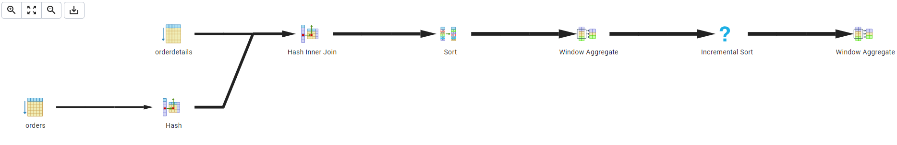
2. MsSQL
   - 110ms
   - 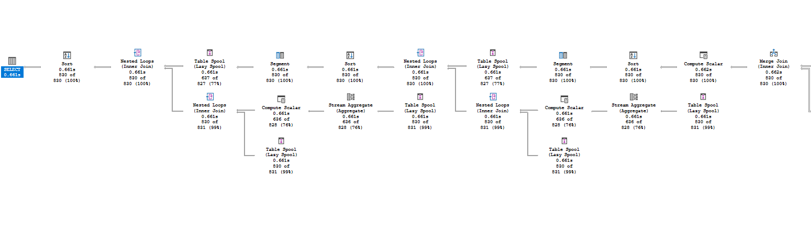
---


# Zadanie 9

Baza: Northwind, tabela product_history

Napisz polecenie które pokaże wartość sprzedaży każdego produktu narastająco od początku każdego miesiąca. Użyj funkcji okna

Zbiór wynikowy powinien zawierać:
- id pozycji
- id produktu
- datę
- wartość sprzedaży produktu w danym dniu
- wartość sprzedaży produktu narastające od początku miesiąca

W przypadku długiego czasu wykonania ogranicz zbiór wynikowy do kilkuset/kilku tysięcy wierszy

```sql
SELECT ID
   , PRODUCTID
   , DATE
   , SUM(VALUE) OVER (PARTITION BY PRODUCTID, DATE) AS PRODUCT_DATE_VALUE
   , SUM(VALUE) OVER (PARTITION BY PRODUCTID
                              , DATE_PART('year', DATE)
                              , DATE_PART('month', DATE)
                     ORDER BY DATE ASC)
FROM Northwind3.PRODUCT_HISTORY ORDER BY PRODUCTID, DATE;

-- bez okna
WITH DAILY AS (
    SELECT
          PRODUCTID
        , DATE
        , SUM(VALUE) AS PRODUCT_DATE_VALUE
    FROM Northwind3.PRODUCT_HISTORY
    GROUP BY PRODUCTID, DATE
)
SELECT
      ph.ID
    , ph.PRODUCTID
    , ph.DATE
    , dps.PRODUCT_DATE_VALUE,
    (   
        SELECT SUM(ph_inner.VALUE)
        FROM Northwind3.PRODUCT_HISTORY ph_inner
        WHERE ph_inner.PRODUCTID = ph.PRODUCTID 
          AND DATE_PART('year', ph_inner.DATE) = DATE_PART('year', ph.DATE)
          AND DATE_PART('month', ph_inner.DATE) = DATE_PART('month', ph.DATE)
          AND ph_inner.DATE <= ph.DATE
    ) AS monthly_cumulative_value 
FROM Northwind3.PRODUCT_HISTORY ph
INNER JOIN DAILY dps 
	ON ph.PRODUCTID = dps.PRODUCTID AND ph.DATE = dps.DATE
ORDER BY ph.PRODUCTID, ph.DATE;
```

Spróbuj wykonać zadanie bez użycia funkcji okna. Spróbuj uzyskać ten sam wynik bez użycia funkcji okna, porównaj wyniki, czasy i plany zapytań. Przetestuj działanie w różnych SZBD (MS SQL Server, PostgreSql, SQLite)

---
> Wyniki: 

```sql
--  ...
```
## Wyniki MsSQL  
1) z funckją okna
   - Czas wykonania 11,8s
   - 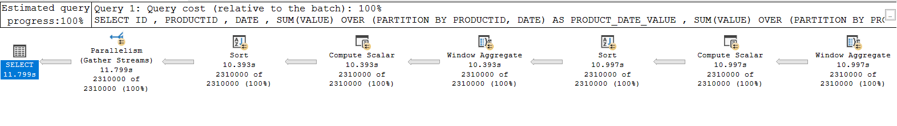
2) bez funkcji okna
   - Czas wykonanie 6,7 [DLA 2000]
   - 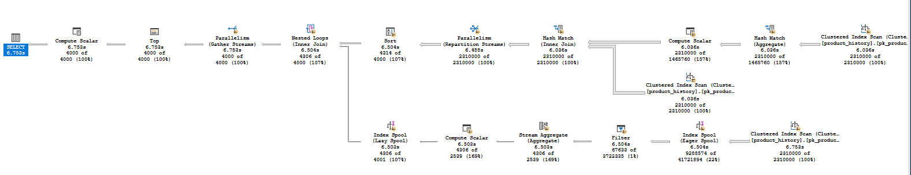

## Wyniki PostgreSQL  
1) z funckją okna
   - Czas wykonania 5,8s
   - 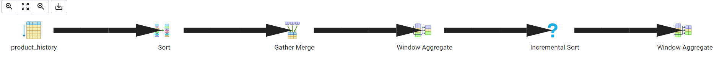
2) bez funkcji okna
   - Czas wykonanie 20s [DLA 2000]
   - 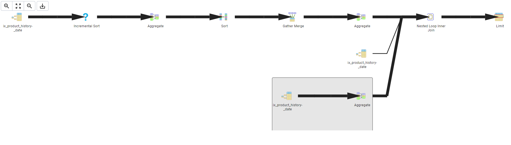
---


# Zadanie 10

Wykonaj kilka "własnych" przykładowych analiz. Czy są jeszcze jakieś ciekawe/przydatne funkcje okna (z których nie korzystałeś w ćwiczeniu)? Spróbuj ich użyć w zaprezentowanych przykładach.

---
> Wyniki: 

```sql
--  ...
```

---
Punktacja

|         |     |
| ------- | --- |
| zadanie | pkt |
| 1       | 2   |
| 2       | 2   |
| 3       | 2   |
| 4       | 2   |
| 5       | 2   |
| 6       | 2   |
| 7       | 2   |
| 8       | 2   |
| 9       | 2   |
| 10      | 2   |
| razem   | 20  |
