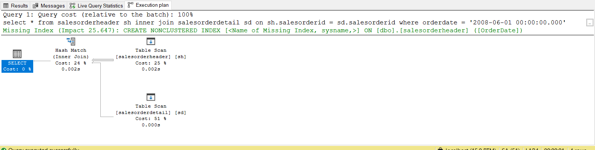
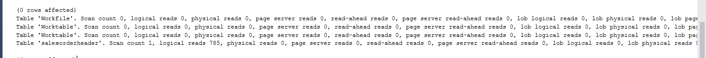
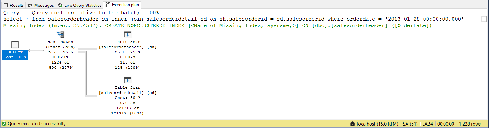
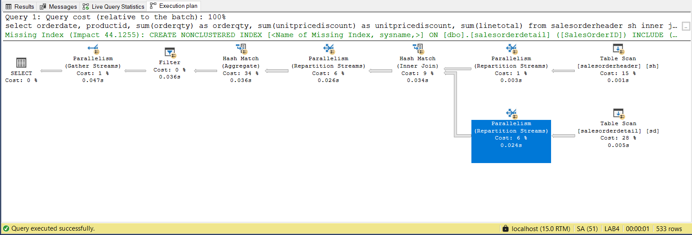
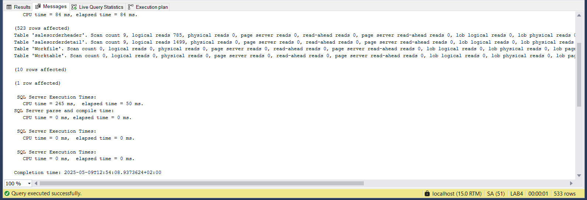
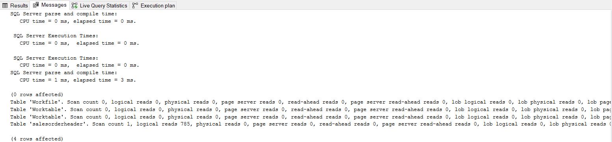
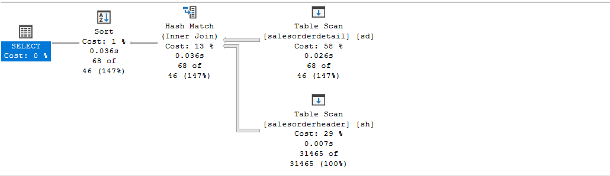
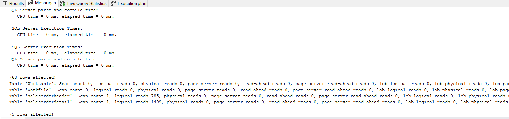

# Indeksy,  optymalizator <br>Lab1

<!-- <style scoped>
 p,li {
    font-size: 12pt;
  }
</style>  -->

<!-- <style scoped>
 pre {
    font-size: 8pt;
  }
</style>  -->


---

**Imiona i nazwiska:**

--- 

Celem ćwiczenia jest zapoznanie się z planami wykonania zapytań (execution plans), oraz z budową i możliwością wykorzystaniem indeksów.

Swoje odpowiedzi wpisuj w miejsca oznaczone jako:

---
> Wyniki: 

```sql
--  ...
```

---

Ważne/wymagane są komentarze.

Zamieść kod rozwiązania oraz zrzuty ekranu pokazujące wyniki
- dołącz kod rozwiązania w formie tekstowej/źródłowej
- można dołączyć plik .md albo .sql

Zwróć uwagę na formatowanie kodu

## Oprogramowanie - co jest potrzebne?

Do wykonania ćwiczenia potrzebne jest następujące oprogramowanie
- MS SQL Server
- SSMS - SQL Server Management Studio    
	- ewentualnie inne narzędzie umożliwiające komunikację z MS SQL Server i analizę planów zapytań
- przykładowa baza danych AdventureWorks2017.
    
Oprogramowanie dostępne jest na przygotowanej maszynie wirtualnej


## Przygotowanie  
    
Stwórz swoją bazę danych o nazwie lab4. 

```sql
create database lab1  
go  
  
use lab1 
go
```


# Część 1

Celem tej części ćwiczenia jest zapoznanie się z planami wykonania zapytań (execution plans) oraz narzędziem do automatycznego generowania indeksów.

## Dokumentacja/Literatura

Przydatne materiały/dokumentacja. Proszę zapoznać się z dokumentacją:
- [https://docs.microsoft.com/en-us/sql/tools/dta/tutorial-database-engine-tuning-advisor](https://docs.microsoft.com/en-us/sql/tools/dta/tutorial-database-engine-tuning-advisor)
- [https://docs.microsoft.com/en-us/sql/relational-databases/performance/start-and-use-the-database-engine-tuning-advisor](https://docs.microsoft.com/en-us/sql/relational-databases/performance/start-and-use-the-database-engine-tuning-advisor)
- [https://www.simple-talk.com/sql/performance/index-selection-and-the-query-optimizer](https://www.simple-talk.com/sql/performance/index-selection-and-the-query-optimizer)
- [https://blog.quest.com/sql-server-execution-plan-what-is-it-and-how-does-it-help-with-performance-problems/](https://blog.quest.com/sql-server-execution-plan-what-is-it-and-how-does-it-help-with-performance-problems/)


Operatory (oraz reprezentujące je piktogramy/Ikonki) używane w graficznej prezentacji planu zapytania opisane są tutaj:
- [https://docs.microsoft.com/en-us/sql/relational-databases/showplan-logical-and-physical-operators-reference](https://docs.microsoft.com/en-us/sql/relational-databases/showplan-logical-and-physical-operators-reference)

<div style="page-break-after: always;"></div>


Wykonaj poniższy skrypt, aby przygotować dane:

```sql
select * into [salesorderheader]  
from [adventureworks2017].sales.[salesorderheader]  
go  
  
select * into [salesorderdetail]  
from [adventureworks2017].sales.[salesorderdetail]  
go
```


# Zadanie 1 - Obserwacja


Wpisz do MSSQL Managment Studio (na razie nie wykonuj tych zapytań):

```sql
-- zapytanie 1  
select *  
from salesorderheader sh  
inner join salesorderdetail sd on sh.salesorderid = sd.salesorderid  
where orderdate = '2008-06-01 00:00:00.000'  
go  

-- zapytanie 1.1
select *  
from salesorderheader sh  
inner join salesorderdetail sd on sh.salesorderid = sd.salesorderid  
where orderdate = '2013-01-28 00:00:00.000' 
go  
  
-- zapytanie 2  
select orderdate, productid, sum(orderqty) as orderqty, 
       sum(unitpricediscount) as unitpricediscount, sum(linetotal)  
from salesorderheader sh  
inner join salesorderdetail sd on sh.salesorderid = sd.salesorderid  
group by orderdate, productid  
having sum(orderqty) >= 100  
go  
  
-- zapytanie 3  
select salesordernumber, purchaseordernumber, duedate, shipdate  
from salesorderheader sh  
inner join salesorderdetail sd on sh.salesorderid = sd.salesorderid  
where orderdate in ('2008-06-01','2008-06-02', '2008-06-03', '2008-06-04', '2008-06-05')  
go  
  
-- zapytanie 4  
select sh.salesorderid, salesordernumber, purchaseordernumber, duedate, shipdate  
from salesorderheader sh  
inner join salesorderdetail sd on sh.salesorderid = sd.salesorderid  
where carriertrackingnumber in ('ef67-4713-bd', '6c08-4c4c-b8')  
order by sh.salesorderid  
go
```


Włącz dwie opcje: **Include Actual Execution Plan** oraz **Include Live Query Statistics**:


<!-- ![[_img/index1-1.png | 500]] -->


Teraz wykonaj poszczególne zapytania (najlepiej każde analizuj oddzielnie). Co można o nich powiedzieć? Co sprawdzają? Jak można je zoptymalizować?  

---
> Wyniki: 
### Zapytanie 1
Wyniki:



Zapytanie zwracające dane z wszystkich kolumn z połączonych za pomocą `salesorderid` tabel `salesorderheader` oraz `salesorderdetail`, które zostało wykonane _2008-06-01_ (nie istnieje takie). Jako, że nie ma tu żadnego indeksu nastąpiło pełne odczytanie tabeli `salesorderheader`, ale, że nie został znaleziony rekord odpowiadający klauzuli _WHERE_ nie nastąpiło pełne odczytanie drugiej tabeli. Z racji na brak indeksów zapytanie jest bardzo nieefektywne . Proponowanym rozwiązaniem tego problemu jest założenie indeksu na klastrowego na kolumnie `salesorderid` (w tym konkretnym przypadku to nie jest bardzo ważne) oraz nieklastrowego na polu `orderdate`, żeby móc przyśpieszyć wybieranie konkretnych ID oraz konkretnych datach. Indeksy również mogłby być stworzone z klauzulą `include` zawierającą odpowiednie kolumny, bardzo rzadko są potrzebne wszystkie.

### Zapytanie 1.1
Wyniki:



Zapytanie o bardzo podobnej charakterystyce co poprzednie, z tą różnicą, że ono zwraca rekordy, więc następuje też odczyt z drugiej tabeli (1499 logicznych operacji). Proponowane usprawnienia są również takie same jak w poprzednim przypadku.

### Zapytanie 2
Wyniki:



Zapytanie zwraca dla każdego produktu z tabeli `salesorderheader` sumę kupionych przedmiotów, sumaryczną cenę oraz sume atrybutu `linetotal`. Korzysta z tabel `salesorderheader` oraz `salesorderdetail` połączonych za pomocą `salesorderid`. Wyniki są następnie sortowane po wartościach funkcji agregującej _sum(orderqty) >= 100_. Z powodu braku indeksów nastąpił pełny odczyt z obydwu tabel (785 + 1499 odczytów logicznych), co również jest bardzo nieefektywne. Można zaobserwować również, że agregacja wyników była bardzo kosztowna, co również może być spowodowane brakiek jakichkolwiek indeksów. Proponowanym usprawnieniem byłoby założenie indeksu klastrowaego  w obu tabelach na kolumnie `salesorderid` oraz nieklastrowych na kolumnach `orderdate`, `productid`.

### Zapytanie 3
Wyniki:



Zapytanie podobinie jak w zap.1 zwraca dane z połączonych za pomocą `salesorderid` tabel `salesorderheader` oraz `salesorderdetail`. Z tą różnicą, że zwracane są tylko dane z konkretnych kolumn oraz szukane są zamówienia wykonane w ciągu dat (również w żadnej z nich żadne zamówienie nie zostało wykonane) Jako, że nie ma tu żadnego indeksu nastąpiło pełne odczytanie tabeli `salesorderheader`, ale, że nie został znaleziony rekord odpowiadający klauzuli _WHERE_ nie nastąpiło pełne odczytanie drugiej tabeli. Z racji na brak indeksów zapytanie jest bardzo nieefektywne . Proponowanym rozwiązaniem tego problemu jest założenie indeksu na klastrowego na kolumnie `salesorderid` (w tym konkretnym przypadku to nie jest bardzo ważne) oraz nieklastrowego na polu `orderdate`, żeby móc przyśpieszyć wybieranie konkretnych ID oraz konkretnych datach.

### Zapytanie 4
Wyniki:




Zapytanie zwraca dane z wybranych kolumn z połączonych  za pomocą `salesorderid` tabel `salesorderheader` oraz `salesorderdetail`, które mają jedno z 2 wybranych `carriertrackingnumber`. Jako, że istnieją takie rekordy i nie ma żadnych indeksów to nastąpił pełny odczyt z obu tabel. Warto zauważyć również, że w tym zapytaniu występuje klauzula `order by`, która co prawda nie jest zbyt kosztowna (być może dlatego, że po filtrze zostaje tylko 68 rekordów), ale mogłaby być przeprowadzona znacznie efektywniej gdyby zastosować indeksy. Proponowanym usprawnieniem byłoby założenie indeksu klastrowego na kolumnie `salesorderid` oraz nieklastrowego na kolumnie `carriertrackingnumber`.
---

# Zadanie 2 - Dobór indeksów / optymalizacja

Do wykonania tego ćwiczenia potrzebne jest narzędzie SSMS

Zaznacz wszystkie zapytania, i uruchom je w **Database Engine Tuning Advisor**:

<!-- ![[_img/index1-12.png | 500]] -->


Sprawdź zakładkę **Tuning Options**, co tam można skonfigurować?

---
> Wyniki: 

```sql
--  ...
```

---


Użyj **Start Analysis**:

<!-- ![[_img/index1-3.png | 500]] -->


Zaobserwuj wyniki w **Recommendations**.

Przejdź do zakładki **Reports**. Sprawdź poszczególne raporty. Główną uwagę zwróć na koszty i ich poprawę:


<!-- ![[_img/index4-1.png | 500]] -->


Zapisz poszczególne rekomendacje:

Uruchom zapisany skrypt w Management Studio.

Opisz, dlaczego dane indeksy zostały zaproponowane do zapytań:

---
> Wyniki: 

```sql
--  ...
```

---


Sprawdź jak zmieniły się Execution Plany. Opisz zmiany:

---
> Wyniki: 
[[lab2-index-opt]]
```sql
--  ...
```

---

# Część 2

Celem ćwiczenia jest zapoznanie się z różnymi rodzajami  indeksów  oraz możliwością ich wykorzystania

## Dokumentacja/Literatura

Przydatne materiały/dokumentacja. Proszę zapoznać się z dokumentacją:
- [https://docs.microsoft.com/en-us/sql/relational-databases/indexes/indexes](https://docs.microsoft.com/en-us/sql/relational-databases/indexes/indexes)
- [https://docs.microsoft.com/en-us/sql/relational-databases/sql-server-index-design-guide](https://docs.microsoft.com/en-us/sql/relational-databases/sql-server-index-design-guide)
- [https://www.simple-talk.com/sql/performance/14-sql-server-indexing-questions-you-were-too-shy-to-ask/](https://www.simple-talk.com/sql/performance/14-sql-server-indexing-questions-you-were-too-shy-to-ask/)
- [https://www.sqlshack.com/sql-server-query-execution-plans-examples-select-statement/](https://www.sqlshack.com/sql-server-query-execution-plans-examples-select-statement/)

# Zadanie 3 - Indeksy klastrowane I nieklastrowane


Skopiuj tabelę `Customer` do swojej bazy danych:

```sql
select * into customer from adventureworks2017.sales.customer
```

Wykonaj analizy zapytań:

```sql
select * from customer where storeid = 594  
  
select * from customer where storeid between 594 and 610
```

Zanotuj czas zapytania oraz jego koszt koszt:

---
> Wyniki: 

```sql
--  ...
```


Dodaj indeks:

```sql
create  index customer_store_cls_idx on customer(storeid)
```

Jak zmienił się plan i czas? Czy jest możliwość optymalizacji?


---
> Wyniki: 

```sql
--  ...
```


Dodaj indeks klastrowany:

```sql
create clustered index customer_store_cls_idx on customer(storeid)
```

Czy zmienił się plan/koszt/czas? Skomentuj dwa podejścia w wyszukiwaniu krotek.


---
> Wyniki: 

```sql
--  ...
```


# Zadanie 4 - dodatkowe kolumny w indeksie

Celem zadania jest porównanie indeksów zawierających dodatkowe kolumny.

Skopiuj tabelę `Address` do swojej bazy danych:

```sql
select * into address from  adventureworks2017.person.address
```

W tej części będziemy analizować następujące zapytanie:

```sql
select addressline1, addressline2, city, stateprovinceid, postalcode  
from address  
where postalcode between n'98000' and n'99999'
```

```sql
create index address_postalcode_1  
on address (postalcode)  
include (addressline1, addressline2, city, stateprovinceid);  
go  
  
create index address_postalcode_2  
on address (postalcode, addressline1, addressline2, city, stateprovinceid);  
go
```


Czy jest widoczna różnica w planach/kosztach zapytań? 
- w sytuacji gdy nie ma indeksów
- przy wykorzystaniu indeksu:
	- address_postalcode_1
	- address_postalcode_2
Jeśli tak to jaka? 

Aby wymusić użycie indeksu użyj `WITH(INDEX(Address_PostalCode_1))` po `FROM`

> Wyniki: 

```sql
--  ...
```

Sprawdź rozmiar Indeksów:

```sql
select i.name as indexname, sum(s.used_page_count) * 8 as indexsizekb  
from sys.dm_db_partition_stats as s  
inner join sys.indexes as i on s.object_id = i.object_id and s.index_id = i.index_id  
where i.name = 'address_postalcode_1' or i.name = 'address_postalcode_2'  
group by i.name  
go
```


Który jest większy? Jak można skomentować te dwa podejścia do indeksowania? Które kolumny na to wpływają?


> Wyniki: 

```sql
--  ...
```


# Zadanie 5 – Indeksy z filtrami

Celem zadania jest poznanie indeksów z filtrami.

Skopiuj tabelę `BillOfMaterials` do swojej bazy danych:

```sql
select * into billofmaterials  
from adventureworks2017.production.billofmaterials
```


W tej części analizujemy zapytanie:

```sql
select productassemblyid, componentid, startdate  
from billofmaterials  
where enddate is not null  
    and componentid = 327  
    and startdate >= '2010-08-05'
```

Zastosuj indeks:

```sql
create nonclustered index billofmaterials_cond_idx  
    on billofmaterials (componentid, startdate)  
    where enddate is not null
```

Sprawdź czy działa. 

Przeanalizuj plan dla poniższego zapytania:

Czy indeks został użyty? Dlaczego?

> Wyniki: 

```sql
--  ...
```

Spróbuj wymusić indeks. Co się stało, dlaczego takie zachowanie?

> Wyniki: 

```sql
--  ...
```


---

Punktacja:

|         |     |
| ------- | --- |
| zadanie | pkt |
| 1       | 3   |
| 2       | 3   |
| 3       | 3   |
| 4       | 3   |
| 5       | 3   |
| razem   | 15  |
|         |     |
