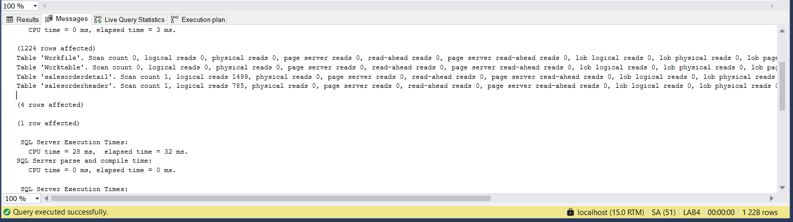
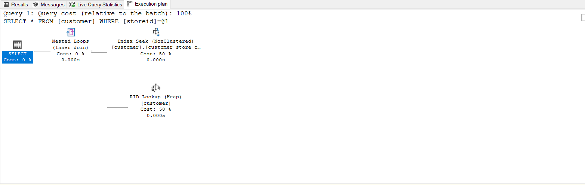

# Indeksy,  optymalizator <br>Lab1

<!-- <style scoped>
 p,li {
    font-size: 12pt;
  }
</style>  -->

<!-- <style scoped>
 pre {
    font-size: 8pt;
  }
</style>  -->


---

**Imiona i nazwiska:** Damian Torbus, Adam Woźny

--- 

Celem ćwiczenia jest zapoznanie się z planami wykonania zapytań (execution plans), oraz z budową i możliwością wykorzystaniem indeksów.

Swoje odpowiedzi wpisuj w miejsca oznaczone jako:

---
> Wyniki: 

```sql
--  ...
```

---

Ważne/wymagane są komentarze.

Zamieść kod rozwiązania oraz zrzuty ekranu pokazujące wyniki
- dołącz kod rozwiązania w formie tekstowej/źródłowej
- można dołączyć plik .md albo .sql

Zwróć uwagę na formatowanie kodu

## Oprogramowanie - co jest potrzebne?

Do wykonania ćwiczenia potrzebne jest następujące oprogramowanie
- MS SQL Server
- SSMS - SQL Server Management Studio    
	- ewentualnie inne narzędzie umożliwiające komunikację z MS SQL Server i analizę planów zapytań
- przykładowa baza danych AdventureWorks2017.
    
Oprogramowanie dostępne jest na przygotowanej maszynie wirtualnej


## Przygotowanie  
    
Stwórz swoją bazę danych o nazwie lab4. 

```sql
create database lab1  
go  
  
use lab1 
go
```


# Część 1

Celem tej części ćwiczenia jest zapoznanie się z planami wykonania zapytań (execution plans) oraz narzędziem do automatycznego generowania indeksów.

## Dokumentacja/Literatura

Przydatne materiały/dokumentacja. Proszę zapoznać się z dokumentacją:
- [https://docs.microsoft.com/en-us/sql/tools/dta/tutorial-database-engine-tuning-advisor](https://docs.microsoft.com/en-us/sql/tools/dta/tutorial-database-engine-tuning-advisor)
- [https://docs.microsoft.com/en-us/sql/relational-databases/performance/start-and-use-the-database-engine-tuning-advisor](https://docs.microsoft.com/en-us/sql/relational-databases/performance/start-and-use-the-database-engine-tuning-advisor)
- [https://www.simple-talk.com/sql/performance/index-selection-and-the-query-optimizer](https://www.simple-talk.com/sql/performance/index-selection-and-the-query-optimizer)
- [https://blog.quest.com/sql-server-execution-plan-what-is-it-and-how-does-it-help-with-performance-problems/](https://blog.quest.com/sql-server-execution-plan-what-is-it-and-how-does-it-help-with-performance-problems/)


Operatory (oraz reprezentujące je piktogramy/Ikonki) używane w graficznej prezentacji planu zapytania opisane są tutaj:
- [https://docs.microsoft.com/en-us/sql/relational-databases/showplan-logical-and-physical-operators-reference](https://docs.microsoft.com/en-us/sql/relational-databases/showplan-logical-and-physical-operators-reference)

<div style="page-break-after: always;"></div>


Wykonaj poniższy skrypt, aby przygotować dane:

```sql
select * into [salesorderheader]  
from [adventureworks2017].sales.[salesorderheader]  
go  
  
select * into [salesorderdetail]  
from [adventureworks2017].sales.[salesorderdetail]  
go
```


# Zadanie 1 - Obserwacja


Wpisz do MSSQL Managment Studio (na razie nie wykonuj tych zapytań):

```sql
-- zapytanie 1  
select *  
from salesorderheader sh  
inner join salesorderdetail sd on sh.salesorderid = sd.salesorderid  
where orderdate = '2008-06-01 00:00:00.000'  
go  

-- zapytanie 1.1
select *  
from salesorderheader sh  
inner join salesorderdetail sd on sh.salesorderid = sd.salesorderid  
where orderdate = '2013-01-28 00:00:00.000' 
go  
  
-- zapytanie 2  
select orderdate, productid, sum(orderqty) as orderqty, 
       sum(unitpricediscount) as unitpricediscount, sum(linetotal)  
from salesorderheader sh  
inner join salesorderdetail sd on sh.salesorderid = sd.salesorderid  
group by orderdate, productid  
having sum(orderqty) >= 100  
go  
  
-- zapytanie 3  
select salesordernumber, purchaseordernumber, duedate, shipdate  
from salesorderheader sh  
inner join salesorderdetail sd on sh.salesorderid = sd.salesorderid  
where orderdate in ('2008-06-01','2008-06-02', '2008-06-03', '2008-06-04', '2008-06-05')  
go  
  
-- zapytanie 4  
select sh.salesorderid, salesordernumber, purchaseordernumber, duedate, shipdate  
from salesorderheader sh  
inner join salesorderdetail sd on sh.salesorderid = sd.salesorderid  
where carriertrackingnumber in ('ef67-4713-bd', '6c08-4c4c-b8')  
order by sh.salesorderid  
go
```


Włącz dwie opcje: **Include Actual Execution Plan** oraz **Include Live Query Statistics**:


<!-- ![[_img/index1-1.png | 500]] -->


Teraz wykonaj poszczególne zapytania (najlepiej każde analizuj oddzielnie). Co można o nich powiedzieć? Co sprawdzają? Jak można je zoptymalizować?  

---
> Wyniki: 
### Zapytanie 1
Wyniki:


Zapytanie zwracające dane z wszystkich kolumn z połączonych za pomocą `salesorderid` tabel `salesorderheader` oraz `salesorderdetail`, które zostało wykonane _2008-06-01_ (nie istnieje takie). Jako, że nie ma tu żadnego indeksu nastąpiło pełne odczytanie tabeli `salesorderheader`, ale, że nie został znaleziony rekord odpowiadający klauzuli _WHERE_ nie nastąpiło pełne odczytanie drugiej tabeli. Z racji na brak indeksów zapytanie jest bardzo nieefektywne . Proponowanym rozwiązaniem tego problemu jest założenie indeksu na klastrowego na kolumnie `salesorderid` (w tym konkretnym przypadku to nie jest bardzo ważne) oraz nieklastrowego na polu `orderdate`, żeby móc przyśpieszyć wybieranie konkretnych ID oraz konkretnych datach. Indeksy również mogłby być stworzone z klauzulą `include` zawierającą odpowiednie kolumny, bardzo rzadko są potrzebne wszystkie.

### Zapytanie 1.1
Wyniki:



Zapytanie o bardzo podobnej charakterystyce co poprzednie, z tą różnicą, że ono zwraca rekordy, więc następuje też odczyt z drugiej tabeli (1499 logicznych operacji). Proponowane usprawnienia są również takie same jak w poprzednim przypadku.

### Zapytanie 2
Wyniki:


Zapytanie zwraca dla każdego produktu z tabeli `salesorderheader` sumę kupionych przedmiotów, sumaryczną cenę oraz sume atrybutu `linetotal`. Korzysta z tabel `salesorderheader` oraz `salesorderdetail` połączonych za pomocą `salesorderid`. Wyniki są następnie sortowane po wartościach funkcji agregującej _sum(orderqty) >= 100_. Z powodu braku indeksów nastąpił pełny odczyt z obydwu tabel (785 + 1499 odczytów logicznych), co również jest bardzo nieefektywne. Można zaobserwować również, że agregacja wyników była bardzo kosztowna, co również może być spowodowane brakiek jakichkolwiek indeksów. Proponowanym usprawnieniem byłoby założenie indeksu klastrowaego  w obu tabelach na kolumnie `salesorderid` oraz nieklastrowych na kolumnach `orderdate`, `productid`.

### Zapytanie 3
Wyniki:


Zapytanie podobinie jak w zap.1 zwraca dane z połączonych za pomocą `salesorderid` tabel `salesorderheader` oraz `salesorderdetail`. Z tą różnicą, że zwracane są tylko dane z konkretnych kolumn oraz szukane są zamówienia wykonane w ciągu dat (również w żadnej z nich żadne zamówienie nie zostało wykonane) Jako, że nie ma tu żadnego indeksu nastąpiło pełne odczytanie tabeli `salesorderheader`, ale, że nie został znaleziony rekord odpowiadający klauzuli _WHERE_ nie nastąpiło pełne odczytanie drugiej tabeli. Z racji na brak indeksów zapytanie jest bardzo nieefektywne . Proponowanym rozwiązaniem tego problemu jest założenie indeksu na klastrowego na kolumnie `salesorderid` (w tym konkretnym przypadku to nie jest bardzo ważne) oraz nieklastrowego na polu `orderdate`, żeby móc przyśpieszyć wybieranie konkretnych ID oraz konkretnych datach.

### Zapytanie 4
Wyniki:


Zapytanie zwraca dane z wybranych kolumn z połączonych  za pomocą `salesorderid` tabel `salesorderheader` oraz `salesorderdetail`, które mają jedno z 2 wybranych `carriertrackingnumber`. Jako, że istnieją takie rekordy i nie ma żadnych indeksów to nastąpił pełny odczyt z obu tabel. Warto zauważyć również, że w tym zapytaniu występuje klauzula `order by`, która co prawda nie jest zbyt kosztowna (być może dlatego, że po filtrze zostaje tylko 68 rekordów), ale mogłaby być przeprowadzona znacznie efektywniej gdyby zastosować indeksy. Proponowanym usprawnieniem byłoby założenie indeksu klastrowego na kolumnie `salesorderid` oraz nieklastrowego na kolumnie `carriertrackingnumber`.
---

# Zadanie 2 - Dobór indeksów / optymalizacja

Do wykonania tego ćwiczenia potrzebne jest narzędzie SSMS

Zaznacz wszystkie zapytania, i uruchom je w **Database Engine Tuning Advisor**:

<!-- ![[_img/index1-12.png | 500]] -->


Sprawdź zakładkę **Tuning Options**, co tam można skonfigurować?

---


W zakładce **Tuning Options** jest możliwość skonfigurowania 

- limitu czasu tunowania - jak długo maksymalnie może potrwac proces ulepszania i rekomendacji 
- obiekty, które są rozważane do utworzenia 
  - indeksy i widoki indeksowane,
  - indeksy (klastrowe i nieklastrowe)
  - indeksy nieklastrowe
  - widoki indeksowane (nie ma bezpośrednich zmian w tabelach)
  - ewaluacja (nic nie zmiania, tylko patrzy jak dobrze wykorzystywane są już instniejące)
- obiekty, które są nie rozważane do zmiany
  - brak ograniczen
  - brak modyfikacji
  - ograniczenie tylko do indeksów klastrowych  
- podejście do partycjonowania
  - brak zmian 
  - pełne przeprojektowania
  - przeprojketowanie z jak najmniejszym wkładem w to
- opcje zaawansowane 
  - maksymalna ilosc kolumn w indeksie
  - maksymalna ilość nowych struktów

Dla naszzego przypadku (labaratorium z indeksów) została wybrana opcja żeby rozważyć stworzenie nowych indeksów, nie zostały nałożone żadne ograniczenia co do modyfikowania istniejących struktur (bo aktualnie żadne nie istnieją) oraz opcja `no partitioning`, ponieważ partycjonowania nie jest bezpośrednim tematem tego labaratorium. 
---


Użyj **Start Analysis**:

<!-- ![[_img/index1-3.png | 500]] -->


Zaobserwuj wyniki w **Recommendations**.

Przejdź do zakładki **Reports**. Sprawdź poszczególne raporty. Główną uwagę zwróć na koszty i ich poprawę:

### Wynikowe rekomendacje:


### Raporty


<!-- ![[_img/index4-1.png | 500]] -->


Zapisz poszczególne rekomendacje:

Uruchom zapisany skrypt w Management Studio.

Opisz, dlaczego dane indeksy zostały zaproponowane do zapytań:

Zostało zaproponowane, aby stworzyć 7 indeksów nieklastrowych. Wygląda na to, że każdy z indeksów został stworzony specjalnie z myślą o konkretnym zapytaniu. Dla każdej konfiguracji zwracanych kolumn oraz kolumn do filtrowania, agregacji, joinów został stworzony osobny indeks. Możemy zoobserwować duży rozmiar indeksów spowodowanych użyciem `select * ...` ponieważ powoduje to stworzeniem indeksu zawierającego wszytskie kolumny. Indeksy zwykle są robione według szablony (`_wszystkie kolumny do filtrowania, agregacji, joinów_`) include (`_wszystkie zwracane kolumny_`)

Można zauważyć, że następują kosmiczne wręcz zmniejszenie kosztów zapytań. Dzieje się tak, ponieważ dzięki zastosowaniu indeksów nie ma potrzeby wykonywania bardzo drogich operacji `scan` (które skanują każdą stronę) tylko można je zastąpić operacjami `seek` (które skanują tylko wybrane strony).
---


---


Sprawdź jak zmieniły się Execution Plany. Opisz zmiany:

---
> Wyniki: 
[[lab2-index-opt]]

### Zapytanie 1


Można zauważyć zmianę operacji `scan` na `seek`, oznacza to, że nie są przeszukiwane wszystkie strony tabeli. Z tego powodu nastąpiła znaczna poprawa liczby przeczytanych stron z 785 do tylko 3. Jako, że nie istnieje rekord o podanych warunkach również nastąpił odczyt z tylko jednej tabeli.

### Zapytanie 1.1


Tutaj również nastąpiła zmiana oparacji z `scan` na `seek`, ale jako, że już takie rekordy istnieją to nastąpił tez odczyt z drugiej tabeli w której w prawdzie nastąpiło zmniejszenie liczby odczytanych stron, ale już nie takie spektakularne (z 1499 na 476)

### Zapytanie 2


Po dodaniu indeksów  widoczna jest zmiana oparacji z `scan` na `seek`, co znacząco ograniczyło koszt zapytania. Dzięki temu operacja Group By miała mniej danych do przetworzenia – liczba logicznych odczytów spadła z 2284 (785 + 1499) do zaledwie kilkudziesięciu. Koszt agregacji również się zmniejszył, ponieważ dane były już częściowo posortowane i zoptymalizowane pod kątem wykonania przez silnik SQL Server.

### Zapytanie 3


Podobnie jak w poprzednich przypadkach, operacja scan została zamieniona na seek dzięki indeksowi na kolumnie orderdate. Pomimo braku wyników odpowiadających warunkowi WHERE, SQL Server przeszukał tylko odpowiednie strony danych, co ograniczyło zużycie zasobów. Liczba odczytów w tabeli salesorderheader spadła z kilkuset do kilku, natomiast z racji braku pasujących rekordów nie nastąpił odczyt z tabeli salesorderdetail.

### Zapytanie 4


W wyniku utworzenia indeksu nieklastrowego na kolumnie carriertrackingnumber, zapytanie przeszło z pełnego scan na wydajny seek. Dodatkowo, ponieważ ORDER BY salesorderid odpowiada naturalnemu porządkowi indeksu klastrowego (jeśli salesorderid to klucz klastra), operacja sortowania była tańsza lub wręcz pominięta. Liczba odczytanych stron w obu tabelach znacznie się zmniejszyła (z 785 i 1499 do kilkudziesięciu lub mniej), co wpłynęło na bardzo zauważalne przyspieszenie działania tego zapytania

---

# Część 2

Celem ćwiczenia jest zapoznanie się z różnymi rodzajami  indeksów  oraz możliwością ich wykorzystania

## Dokumentacja/Literatura

Przydatne materiały/dokumentacja. Proszę zapoznać się z dokumentacją:
- [https://docs.microsoft.com/en-us/sql/relational-databases/indexes/indexes](https://docs.microsoft.com/en-us/sql/relational-databases/indexes/indexes)
- [https://docs.microsoft.com/en-us/sql/relational-databases/sql-server-index-design-guide](https://docs.microsoft.com/en-us/sql/relational-databases/sql-server-index-design-guide)
- [https://www.simple-talk.com/sql/performance/14-sql-server-indexing-questions-you-were-too-shy-to-ask/](https://www.simple-talk.com/sql/performance/14-sql-server-indexing-questions-you-were-too-shy-to-ask/)
- [https://www.sqlshack.com/sql-server-query-execution-plans-examples-select-statement/](https://www.sqlshack.com/sql-server-query-execution-plans-examples-select-statement/)

# Zadanie 3 - Indeksy klastrowane I nieklastrowane


Skopiuj tabelę `Customer` do swojej bazy danych:

```sql
select * into customer from adventureworks2017.sales.customer
```

Wykonaj analizy zapytań:

```sql
select * from customer where storeid = 594  
  
select * from customer where storeid between 594 and 610
```

Zanotuj czas zapytania oraz jego koszt koszt:

---
> Wyniki: 
Każde z zapytań wybiera wartość wszystkich kolumn z pewnymi warunkami dla wierszy, które są różne dla zapytania.

### Zapytanie 1


Zapytanie zostało zrealizowane poprzez kosztowną operacje `scan`, ponieważ gdy nie ma indeksu, żeby zastosować warunek z klauzuli `WHERE` trzeba przejrzeć każdy rekord. Został zwrócony 1 rekord z 8 kolumnami. Czas trwania wynosił 2ms, a jego koszt 0,1391581. Zostało wykonane 155 logicznych odczytów.

### Zapytanie 2


Zapytanie zostało tak samo jak poprzednie zrealizowane przez kosztowną operacje `scan`, z tych samych powodów, również aby zebrać wszytskie rekordy spełniające klauzulę `WHERE` trzeba je wszytskie przeczytać. Czas rownież wynosił 2ms, koszt 0,1391581. Również zostało wykonane 155 logicznych odczytów.


Dodaj indeks:

```sql
create  index customer_store_cls_idx on customer(storeid)
```

Jak zmienił się plan i czas? Czy jest możliwość optymalizacji?


---
> Wyniki: 

### Zapytanie 1



Można zauważyć znacząco różny plan wykonania zapytania, tym razem zamiast operacji `scan` została wykonana operacja `seek` oraz `rid lookup`. Możemy zaobserwować również znaczący spadek kosztu (0,1391581 => 0,00657038), ilości odczytów logicznych (155 => 3) oraz czasu (0,002 => 0,0001581). Dzieje się tak dlatego, że dzięki założeniu indeksu, nie ma już potrzeby odczytania każdego rekordu, żeby znaleźć wszystkie spełniające klauzulę `WHERE`, a w zasadzie wystarczy tylko z +-jednej strony (plus też koszt dojścia do tej strony). Potencjalnym polem do optymalizacji zapytania jest wyeleminowanie potencjalnie drogiej operacji `rid lookup`, która odpowiada za dołączenie do wyniku zapytania wartości kolumn innych niż ten na których jest założony (lub tych, które uwzględnia w swojej strukturze) indeks nieklastrowy, poprzez zredukowanie liczby zwracanych kolumn, dołożenie poprzez klauzulę `include` kolumn do indeksu, które chcemy zobaczyć w wyniku, ewentualnie założyć indeks na kolumnach które chcemy zobaczyć w wyniku (to nie jest zbyt dobry pomysł, indeks będzie bardzo duży, a wcale nie filtrujemy po innych kolumnach) lub zastosowanie indeksu klastrowanego 

### Zapytanie 2


Ogólny plan zapytania zmienił się podobnie jak w punkcie wyżej, ale tutaj możeemy zaobserwować o wiele mniej spektakularne poprawy kosztów: czasu z 0,002 => 0,0001746, kosztu z 0,1391581 => 0,0507122 oraz ilości odczytów logicznych 155 => 18. Dzieje się tak za sprawą wysokiego kosztu operacji `rid lookup` (wykonuje się ona dla rekordów, które spełniają klauzulę `WHERE`, których w tym przypadku jest o wiele 16x więcej niż w poprzednim). W tym przypadku opisane wyżej metody optymalizacji pozwolą na jeszcze większy postęp, bo element zapytania, który jest przez nie redukowany zajmuje procentowo o wiele większą cześć całego wykonania zapytania.


Dodaj indeks klastrowany:

```sql
create clustered index customer_store_cls_idx on customer(storeid) -- nie zadziala, zdublowanie nazwy 
```

Czy zmienił się plan/koszt/czas? Skomentuj dwa podejścia w wyszukiwaniu krotek.


---
> Wyniki: 

### Zapytanie 1


Znowu możemy zaobseerwować znaczącą zmianę planu zapytania, zamiast operacji `seek` oraz `rid lookup` została wykonana operacja `seek`, ale na indeksie klastrowym. Możemy zaobserwować zmniejszenie się czasu 0,0001746 => 0,0001581, kosztu 0,00657038 => 0,0032831. Ilość logicznych odczytów stron wynosi 2. Spadek kosztów wynika z użycia indeksu klastrowanego, który z racji na swoją budowę (w zasadzie z racji na to, że fizycznie jest tabelą z danymi) eleminuje potrzebe dołączenie do wyniku zapytania wartości kolumn innych niż ten na których założony jest indeks, w indeksie fizycznie znajduje się wartość wszytkich kolumn.

### Zapytanie 2


Możemy zaobserwować dokładnie taką samą zmiane planu zapytań co w przypadku wyżej, z tym, że w tej sytacji zmiana przynosi o wiele bardziej spektakularne efekty, ponieważ w poprzedniej formie zapytania droga operacja `rid lookup`, która teraz została wyeliminowana, została wykonana dla 16 krotnie większej ilości rekordów. Czas pozostał ten sam, koszt zmalał z 0,0507122 => 0,0032996 oraz ilość odczytów logicznych z 18 => 2.

### Podejścia w wyszukiwaniu krotek
Zastosowane podejścia wyżej w w wyszukiwaniu krotek: indeks klastrowany oraz indeks nieklastrowany, znacząco poprawiają efektywność zapytań w porównaniu do ich braku, przy zastosowaniu warunku z klauzulą `WHERE`. Pozwalają na nieprzeszukiwania wszystkich rekordów w celu sprawdzenia klauzuli. Jednakże występują znaczące różnice pomiedzy nimi, w indeksie nieklastrowym bezpośredni dostęp jest do kolumn na których założony jest indeks oraz tych uwzględnionych w klauzuli `include` do reszty kolumn wymagana jest operacja `rid lookup`, która jest bardziej kosztowna. Z racji na to, że indeks klastrowany możemy założyć tylko jeden na całą tabele, trzeba bardzo rozważnie podchodzić do jego tworzenia. W przypadku kiedy nie mamy pewności, że bedzie najlepszym rozwiązaniem można zastosować indeks nieklastrowy wraz z klauzula `include` zawierającą porządane kolumy - je także powinniśmy dobierać rozważnie, rzadko kiedy potrzebne są wszystkie 


# Zadanie 4 - dodatkowe kolumny w indeksie

Celem zadania jest porównanie indeksów zawierających dodatkowe kolumny.

Skopiuj tabelę `Address` do swojej bazy danych:

```sql
select * into address from  adventureworks2017.person.address
```

W tej części będziemy analizować następujące zapytanie:

```sql
select addressline1, addressline2, city, stateprovinceid, postalcode  
from address  
where postalcode between n'98000' and n'99999'
```

```sql
create index address_postalcode_1  
on address (postalcode)  
include (addressline1, addressline2, city, stateprovinceid);  
go  
  
create index address_postalcode_2  
on address (postalcode, addressline1, addressline2, city, stateprovinceid);  
go
```


Czy jest widoczna różnica w planach/kosztach zapytań? 
- w sytuacji gdy nie ma indeksów
- przy wykorzystaniu indeksu:
	- address_postalcode_1
	- address_postalcode_2
Jeśli tak to jaka? 

Aby wymusić użycie indeksu użyj `WITH(INDEX(Address_PostalCode_1))` po `FROM`

> Wyniki: 

```sql
--  ...
```

Sprawdź rozmiar Indeksów:

```sql
select i.name as indexname, sum(s.used_page_count) * 8 as indexsizekb  
from sys.dm_db_partition_stats as s  
inner join sys.indexes as i on s.object_id = i.object_id and s.index_id = i.index_id  
where i.name = 'address_postalcode_1' or i.name = 'address_postalcode_2'  
group by i.name  
go
```


Który jest większy? Jak można skomentować te dwa podejścia do indeksowania? Które kolumny na to wpływają?


> Wyniki: 

```sql
--  ...
```


# Zadanie 5 – Indeksy z filtrami

Celem zadania jest poznanie indeksów z filtrami.

Skopiuj tabelę `BillOfMaterials` do swojej bazy danych:

```sql
select * into billofmaterials  
from adventureworks2017.production.billofmaterials
```


W tej części analizujemy zapytanie:

```sql
select productassemblyid, componentid, startdate  
from billofmaterials  
where enddate is not null  
    and componentid = 327  
    and startdate >= '2010-08-05'
```

Zastosuj indeks:

```sql
create nonclustered index billofmaterials_cond_idx  
    on billofmaterials (componentid, startdate)  
    where enddate is not null
```

Sprawdź czy działa. 

Przeanalizuj plan dla poniższego zapytania:

Czy indeks został użyty? Dlaczego?

> Wyniki: 

```sql
--  ...
```

Spróbuj wymusić indeks. Co się stało, dlaczego takie zachowanie?

> Wyniki: 

```sql
--  ...
```


---

Punktacja:

|         |     |
| ------- | --- |
| zadanie | pkt |
| 1       | 3   |
| 2       | 3   |
| 3       | 3   |
| 4       | 3   |
| 5       | 3   |
| razem   | 15  |
|         |     |
