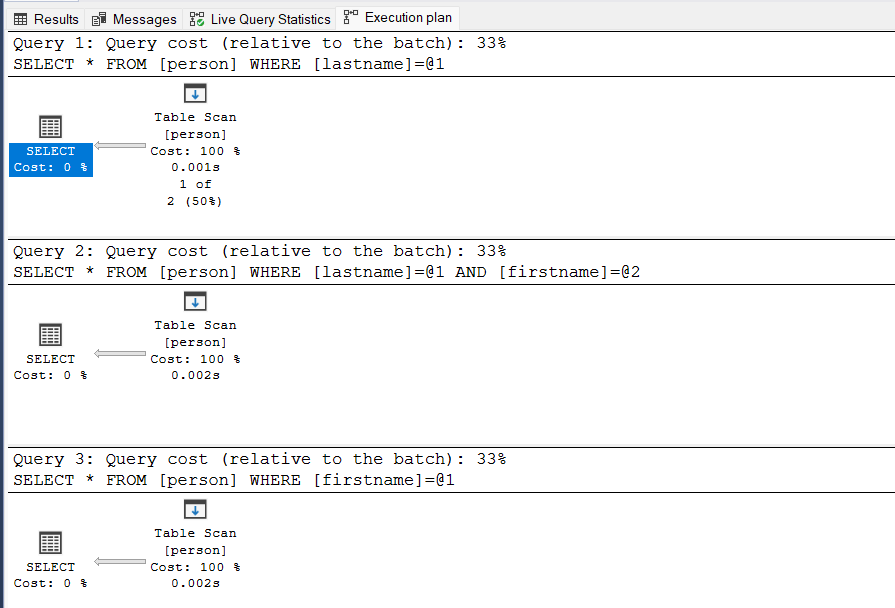
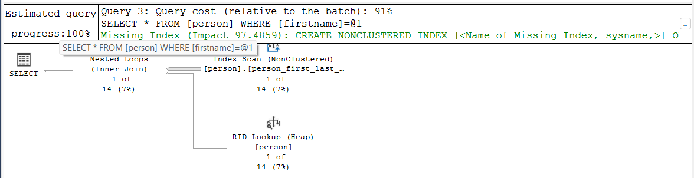
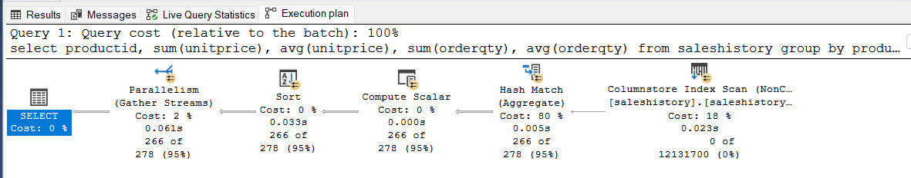

# Indeksy, optymalizator <br>Lab 2

<!-- <style scoped>
 p,li {
    font-size: 12pt;
  }
</style>  -->

<!-- <style scoped>
 pre {
    font-size: 8pt;
  }
</style>  -->

---

**Imię i nazwisko:**

---

Celem ćwiczenia jest zapoznanie się z planami wykonania zapytań (execution plans), oraz z budową i możliwością wykorzystaniem indeksów

Swoje odpowiedzi wpisuj w miejsca oznaczone jako:

---

> Wyniki:

```sql
--  ...
```

---

Ważne/wymagane są komentarze.

Zamieść kod rozwiązania oraz zrzuty ekranu pokazujące wyniki, (dołącz kod rozwiązania w formie tekstowej/źródłowej)

Zwróć uwagę na formatowanie kodu

## Oprogramowanie - co jest potrzebne?

Do wykonania ćwiczenia potrzebne jest następujące oprogramowanie

- MS SQL Server
- SSMS - SQL Server Management Studio
  - ewentualnie inne narzędzie umożliwiające komunikację z MS SQL Server i analizę planów zapytań
- przykładowa baza danych AdventureWorks2017.

Oprogramowanie dostępne jest na przygotowanej maszynie wirtualnej

## Przygotowanie

Uruchom Microsoft SQL Managment Studio.

Stwórz swoją bazę danych o nazwie lab2.

```sql
create database lab2
go

use lab2
go
```

<div style="page-break-after: always;"></div>

# Zadanie 1

Skopiuj tabelę `Person` do swojej bazy danych:

```sql
select businessentityid
      ,persontype
      ,namestyle
      ,title
      ,firstname
      ,middlename
      ,lastname
      ,suffix
      ,emailpromotion
      ,rowguid
      ,modifieddate
into person
from adventureworks2017.person.person
```

---

Wykonaj analizę planu dla trzech zapytań:

```sql
select * from [person] where lastname = 'Agbonile'

select * from [person] where lastname = 'Agbonile' and firstname = 'Osarumwense'

select * from [person] where firstname = 'Osarumwense'
```

Co można o nich powiedzieć?

---

> Wyniki:




### Komentarz:
Dla wszystkich trzech zapytań wynik jest identyczny - zwracany jest jeden rekord osoby:
- firstname = 'Osarumwense'
- lastname = 'Agbonile'

Analiza pokazuje, że mimo identycznego planu wykonania (Table Scan) dla wszystkich trzech zapytań, różnią się one selektywnością. Zapytanie 2 (WHERE lastname = 'Agbonile' AND firstname = 'Osarumwense') jest najbardziej precyzyjne, bo trafia dokładnie w jeden wiersz. Zapytanie 3 (WHERE firstname = 'Osarumwense') przeszukuje aż 14 wierszy i ma najgorszą selektywność. Brak indeksów powoduje, że SQL Server musi skanować całą tabelę niezależnie od dokładności zapytania.

Przygotuj indeks obejmujący te zapytania:

```sql
create index person_first_last_name_idx
on person(lastname, firstname)
```

Sprawdź plan zapytania. Co się zmieniło?

---

> Wyniki:





### Komentarz:
Po utworzeniu indeksu na kolumnach (lastname, firstname) zapytania filtrujące po nazwisku oraz po nazwisku i imieniu zostały znacząco zoptymalizowane – zaczęły korzystać z operacji Index Seek, co obniżyło ich koszt do 4–5%. Zapytanie filtrujące tylko po imieniu nadal korzysta z Index Scan, ponieważ nie może użyć indeksu zaczynającego się od lastname. W efekcie jego koszt wzynosi aż 91%, a SQL Server sam zasugerował utworzenie dodatkowego indeksu na firstname. Aby zoptymalizować wszystkie trzy zapytania, warto więc dodać również osobny indeks na kolumnie firstname.


Przeprowadź ponownie analizę zapytań tym razem dla parametrów: `FirstName = ‘Angela’` `LastName = ‘Price’`. (Trzy zapytania, różna kombinacja parametrów).

Czym różni się ten plan od zapytania o `'Osarumwense Agbonile'` . Dlaczego tak jest?

---

> Wyniki:


### Komentarz:
W przypadku zapytań dla Angela i Price SQL Server częściej używał pełnego skanowania tabeli (Table Scan), ponieważ wartości Price i Angela występują bardzo często, co czyni warunki mało selektywnymi. Dla Osarumwense i Agbonile, gdzie dane były unikalne, wykorzystywany był Index Seek, co było bardziej wydajne. Różnica wynika z selektywności - im rzadsze dane, tym większa szansa na użycie indeksu.

# Zadanie 2

Skopiuj tabelę Product do swojej bazy danych:

```sql
select * into product from adventureworks2017.production.product
```

Stwórz indeks z warunkiem przedziałowym:

```sql
create nonclustered index product_range_idx
    on product (productsubcategoryid, listprice) include (name)
where productsubcategoryid >= 27 and productsubcategoryid <= 36
```

Sprawdź, czy indeks jest użyty w zapytaniu:

```sql
select name, productsubcategoryid, listprice
from product
where productsubcategoryid >= 27 and productsubcategoryid <= 36
```

Sprawdź, czy indeks jest użyty w zapytaniu, który jest dopełnieniem zbioru:

```sql
select name, productsubcategoryid, listprice
from product
where productsubcategoryid < 27 or productsubcategoryid > 36
```

Skomentuj oba zapytania. Czy indeks został użyty w którymś zapytaniu, dlaczego? Jak działają indeksy z warunkiem?

---

> Wyniki:

```sql
--  ...
```

# Zadanie 3

Skopiuj tabelę `PurchaseOrderDetail` do swojej bazy danych:

```sql
select * into purchaseorderdetail from  adventureworks2017.purchasing.purchaseorderdetail
```

Wykonaj analizę zapytania:

```sql
select rejectedqty, ((rejectedqty/orderqty)*100) as rejectionrate, productid, duedate
from purchaseorderdetail
order by rejectedqty desc, productid asc
```

Która część zapytania ma największy koszt?

---

> Wyniki:

```sql
--  ...
```

Jaki indeks można zastosować aby zoptymalizować koszt zapytania? Przygotuj polecenie tworzące index.

---

> Wyniki:

```sql
--  ...
```

Ponownie wykonaj analizę zapytania:

---

> Wyniki:

```sql
--  ...
```

# Zadanie 4 – indeksy column store

Celem zadania jest poznanie indeksów typu column store

Utwórz tabelę testową:

```sql
create table dbo.saleshistory(
 salesorderid int not null,
 salesorderdetailid int not null,
 carriertrackingnumber nvarchar(25) null,
 orderqty smallint not null,
 productid int not null,
 specialofferid int not null,
 unitprice money not null,
 unitpricediscount money not null,
 linetotal numeric(38, 6) not null,
 rowguid uniqueidentifier not null,
 modifieddate datetime not null
 )
```

Załóż indeks:

```sql
create clustered index saleshistory_idx
on saleshistory(salesorderdetailid)
```

Wypełnij tablicę danymi:

(UWAGA `GO 100` oznacza 100 krotne wykonanie polecenia. Jeżeli podejrzewasz, że Twój serwer może to zbyt przeciążyć, zacznij od GO 10, GO 20, GO 50 (w sumie już będzie 80))

```sql
insert into saleshistory
 select sh.*
 from adventureworks2017.sales.salesorderdetail sh
go 100
```

Sprawdź jak zachowa się zapytanie, które używa obecny indeks:

```sql
select productid, sum(unitprice), avg(unitprice), sum(orderqty), avg(orderqty)
from saleshistory
group by productid
order by productid
```
> Wyniki:


### Komentarz:
Wyniki pokazują, że zapytanie musiało przetworzyć ponad 12 milionów wierszy za pomocą Clustered Index Scan, co wiązało się z dużym kosztem. SQL Server użył równoległości i operacji Hash Match, co potwierdza, że klasyczny indeks klastrowy nie jest wydajny przy analizach z agregacjami.

Załóż indeks typu column store:

```sql
create nonclustered columnstore index saleshistory_columnstore
 on saleshistory(unitprice, orderqty, productid)
```

Sprawdź różnicę pomiędzy przetwarzaniem w zależności od indeksów. Porównaj plany i opisz różnicę.
Co to są indeksy colums store? Jak działają? (poszukaj materiałów w internecie/literaturze)

---

> Wyniki:




### Komentarz:
Zastosowanie indeksu typu columnstore znacząco przyspieszyło zapytanie agregujące – czas wykonania spadł z około 0,40 s do 0,16 s. SQL Server zamiast pełnego skanowania wierszy (Clustered Index Scan) użył odczytu kolumnowego (Columnstore Index Scan) i przetwarzania wsadowego, co pozwoliło na szybsze i bardziej efektywne wykonanie operacji. Columnstore indexy przechowują dane w kolumnach, co ułatwia kompresję i redukuje ilość danych do przetworzenia. Tego typu indeksy są idealne do analiz dużych zbiorów danych z użyciem agregacji i GROUP BY.


# Zadanie 5 – własne eksperymenty

Należy zaprojektować tabelę w bazie danych, lub wybrać dowolny schemat danych (poza używanymi na zajęciach), a następnie wypełnić ją danymi w taki sposób, aby zrealizować poszczególne punkty w analizie indeksów. Warto wygenerować sobie tabele o większym rozmiarze.

Do analizy, proszę uwzględnić następujące rodzaje indeksów:

- Klastrowane (np.  dla atrybutu nie będącego kluczem głównym)
- Nieklastrowane
- Indeksy wykorzystujące kilka atrybutów, indeksy include
- Filtered Index (Indeks warunkowy)
- Kolumnowe

## Analiza

Proszę przygotować zestaw zapytań do danych, które:

- wykorzystują poszczególne indeksy
- które przy wymuszeniu indeksu działają gorzej, niż bez niego (lub pomimo założonego indeksu, tabela jest w pełni skanowana)
  Odpowiedź powinna zawierać:
- Schemat tabeli
- Opis danych (ich rozmiar, zawartość, statystyki)
- Opis indeksu
- Przygotowane zapytania, wraz z wynikami z planów (zrzuty ekranow)
- Komentarze do zapytań, ich wyników
- Sprawdzenie, co proponuje Database Engine Tuning Advisor (porównanie czy udało się Państwu znaleźć odpowiednie indeksy do zapytania)

> Wyniki:

```sql
--  ...
```

|         |     |     |
| ------- | --- | --- |
| zadanie | pkt |     |
| 1       | 2   |     |
| 2       | 2   |     |
| 3       | 2   |     |
| 4       | 2   |     |
| 5       | 5   |     |
| razem   | 15  |     |
