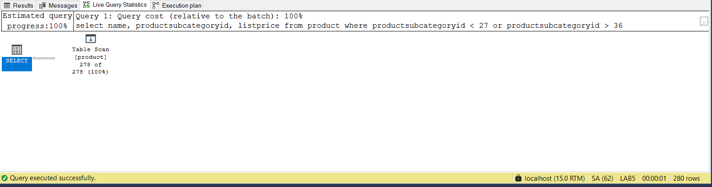
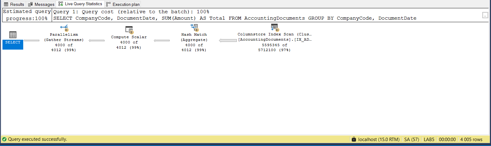

# Indeksy,  optymalizator <br>Lab 2

<!-- <style scoped>
 p,li {
    font-size: 12pt;
  }
</style>  -->

<!-- <style scoped>
 pre {
    font-size: 8pt;
  }
</style>  -->

---

**Imię i nazwisko:** Damian Torbus, Adam Woźny

--- 

Celem ćwiczenia jest zapoznanie się z planami wykonania zapytań (execution plans), oraz z budową i możliwością wykorzystaniem indeksów 


Swoje odpowiedzi wpisuj w miejsca oznaczone jako:

---
> Wyniki: 


```sql
--  ...
```

---

Ważne/wymagane są komentarze.

Zamieść kod rozwiązania oraz zrzuty ekranu pokazujące wyniki, (dołącz kod rozwiązania w formie tekstowej/źródłowej)

Zwróć uwagę na formatowanie kodu

## Oprogramowanie - co jest potrzebne?

Do wykonania ćwiczenia potrzebne jest następujące oprogramowanie

- MS SQL Server
- SSMS - SQL Server Management Studio
  - ewentualnie inne narzędzie umożliwiające komunikację z MS SQL Server i analizę planów zapytań
- przykładowa baza danych AdventureWorks2017.

Oprogramowanie dostępne jest na przygotowanej maszynie wirtualnej

## Przygotowanie

Uruchom Microsoft SQL Managment Studio.

Stwórz swoją bazę danych o nazwie lab2.

```sql
create database lab2
go

use lab2
go
```

<div style="page-break-after: always;"></div>

# Zadanie 1

Skopiuj tabelę `Person` do swojej bazy danych:

```sql
select businessentityid
      ,persontype
      ,namestyle
      ,title
      ,firstname
      ,middlename
      ,lastname
      ,suffix
      ,emailpromotion
      ,rowguid
      ,modifieddate
into person
from adventureworks2017.person.person
```
---

Wykonaj analizę planu dla trzech zapytań:

```sql

select * from [person] where lastname = 'Agbonile'

select * from [person] where lastname = 'Agbonile' and firstname = 'Osarumwense'

select * from [person] where firstname = 'Osarumwense'
```

Co można o nich powiedzieć?

---

> Wyniki:


### Komentarz:
Dla wszystkich trzech zapytań wynik jest identyczny - zwracany jest jeden rekord osoby:
- firstname = 'Osarumwense'
- lastname = 'Agbonile'

Analiza pokazuje, że mimo identycznego planu wykonania (Table Scan) dla wszystkich trzech zapytań, różnią się one selektywnością. Zapytanie 2 (WHERE lastname = 'Agbonile' AND firstname = 'Osarumwense') jest najbardziej precyzyjne, bo trafia dokładnie w jeden wiersz. Zapytanie 3 (WHERE firstname = 'Osarumwense') przeszukuje aż 14 wierszy i ma najgorszą selektywność. Brak indeksów powoduje, że SQL Server musi skanować całą tabelę niezależnie od dokładności zapytania.

Przygotuj indeks obejmujący te zapytania:

```sql
create index person_first_last_name_idx

on person(lastname, firstname)
```

Sprawdź plan zapytania. Co się zmieniło?

---

> Wyniki:


### Komentarz:
Po utworzeniu indeksu na kolumnach (lastname, firstname) zapytania filtrujące po nazwisku oraz po nazwisku i imieniu zostały znacząco zoptymalizowane – zaczęły korzystać z operacji Index Seek, co obniżyło ich koszt do 4–5%. Zapytanie filtrujące tylko po imieniu nadal korzysta z Index Scan, ponieważ nie może użyć indeksu zaczynającego się od lastname. W efekcie jego koszt wzynosi aż 91%, a SQL Server sam zasugerował utworzenie dodatkowego indeksu na firstname. Aby zoptymalizować wszystkie trzy zapytania, warto więc dodać również osobny indeks na kolumnie firstname.


Przeprowadź ponownie analizę zapytań tym razem dla parametrów: `FirstName = ‘Angela’` `LastName = ‘Price’`. (Trzy zapytania, różna kombinacja parametrów).

Czym różni się ten plan od zapytania o `'Osarumwense Agbonile'` . Dlaczego tak jest?

---

> Wyniki:


### Komentarz:
W przypadku zapytań dla Angela i Price SQL Server częściej używał pełnego skanowania tabeli (Table Scan), ponieważ wartości Price i Angela występują bardzo często, co czyni warunki mało selektywnymi. Dla Osarumwense i Agbonile, gdzie dane były unikalne, wykorzystywany był Index Seek, co było bardziej wydajne. Różnica wynika z selektywności - im rzadsze dane, tym większa szansa na użycie indeksu.

# Zadanie 2

Skopiuj tabelę Product do swojej bazy danych:

```sql
select * into product from adventureworks2017.production.product
```

Stwórz indeks z warunkiem przedziałowym:

```sql

create nonclustered index product_range_idx  
    on product (productsubcategoryid, listprice) include (name)  
where productsubcategoryid >= 27 and productsubcategoryid <= 36
```

Sprawdź, czy indeks jest użyty w zapytaniu:

```sql
select name, productsubcategoryid, listprice  
from product  
where productsubcategoryid >= 27 and productsubcategoryid <= 36
```


Sprawdź, czy indeks jest użyty w zapytaniu, który jest dopełnieniem zbioru:

```sql
select name, productsubcategoryid, listprice  
from product  
where productsubcategoryid < 27 or productsubcategoryid > 36
```


Skomentuj oba zapytania. Czy indeks został użyty w którymś zapytaniu, dlaczego?  Jak działają indeksy z warunkiem?

Postanowaliśmy również dołożyć zapytanie 3, którego celem jest sprawdzenie przypadku, kiedy zbiór danych, które pokrywa zapytanie będzie częściowo rozłączny z danymi na ktorych został założony indeks.
```sql
select name, productsubcategoryid, listprice
from product
where productsubcategoryid >= 26 and productsubcategoryid <= 36;
``` 

---
> Wyniki: 

### Zapytanie 1


Indeks został użyty w tym zapytaniu, dzieje się tak, dlatego, że zakres danych, które obejmuje zapytanie zawiera się w przedziale (dla danej kolumny) na którym został założony indeks. Z racji użycia indeksu zostały wykonane tylko 2 operacje logicznego odczytania, koszt wyniósł 0,0033007.

### Zapytanie 2



Indeks nie został użyty w tym zapytaniu, dzieje się tak, dlatego, że zakres danych, które obejmuje zapytanie jest rozłączny z przedziałem, na którym został założony indeks. Z racji braku użycia indeksu zostały wykonane 13 operacje logicznego odczytania, koszt wyniósł 0,01272529.

### Zapytanie 3

Pomimo częsciowej zgodności danymi które obejmuje indeks i zapytanie, została wykonana operacja pełnego skanowania tabeli, koszty porównywalne jak w zapytaniu 2.

Oba zapytania wybierają kolumny `name`, `productsubcategoryid`, `listprice` z tabeli `product`, oba dodatkowo posiadają w swojej strukturze klauzulę `WHERE`. Pierwsze zapytanie skorzystało z już istniejącego indeksu `product_range_idx`, założonego na kolumnach `productsubcategoryid`, `listprice` z warunkiem `productsubcategoryid >= 27 and productsubcategoryid <= 36`, ponieważ warunki zapytania obejmowały dane, które spełniają warunek indeksu. W przypadku drugiego zapytania sytuacja była odwrotna, dane, które były objęte zapytaniem nie zawierały się w danych, na których był założony indeks. Dzięki temu, że indeks był założony lub uwzględniał każdą z kolumn nie musiały być wykonywane żadne inne operacje poza `index seek`, co widać w kosztach zapytań (0,0033007 vs 0,01272529). Indeksy z warunkiem to indeksy nieklastrowane, które w swojej strukturze obejmują tylko podzbiór rekordów spełniejący wspomniany warunek, przez co pozwalają na efektywne wyszukiwania danych tylko z tego podzbioru. Wykorzystuje się je ponieważ są tanie w budowie, utrzymaniu, zajmują mniej miejsca oraz pozwalają na szybsze wykonanie operacji `index seek` z racji na swój mniejszy rozmiar. Trzeba być jednak ostrożnym podczas zakładania, ponieważ jakikolwiek brak pokrycia danych z zapytania poprzez indeks wymusza pełne skanowanie tabeli.


# Zadanie 3

Skopiuj tabelę `PurchaseOrderDetail` do swojej bazy danych:

```sql
select * into purchaseorderdetail from  adventureworks2017.purchasing.purchaseorderdetail
```

Wykonaj analizę zapytania:

```sql
select rejectedqty, ((rejectedqty/orderqty)*100) as rejectionrate, productid, duedate  
from purchaseorderdetail  
order by rejectedqty desc, productid asc
```

Która część zapytania ma największy koszt?

---
> Wyniki: 


Zapytanie wybiera z tabeli `purchaseorderdetail` wartości kolumn `rejectedqty`, `orderqty`, `productid`, `duedate` (lub też rózne wyrażenia zbudowane na ich podstawie), posortowane według `rejectedqty` malejąco i `productid` rosnąco. Analizując plan zapytania oraz jego koszt można zauważyć, że najbardziej kosztowną operacją podczas całego zapytania było `sort` (87% kosztów całego). Zostało przeprowadzone pełne skanowanie tabeli, które wymagało jedynie 13% kosztów całego zapytania. Zostało przeprowadzone 78 operacji logicznego odczytu, sumaryczny koszt zapytania wynosił 0,5274329 i trwało 17ms.

Jaki indeks można zastosować aby zoptymalizować koszt zapytania? Przygotuj polecenie tworzące index.

Jako, że występuje tu sortowanie na dwóch kolumnach, niemonotoniczne wobec siebie nawzajem (przy jednej kolumnie jest DESC, a przy drugiej ASC), proponujemy, aby stworzyć indeks nieklastrowany na tych własnie kolumnach, uwzględniający inne kolumny zwracane przez zapytanie oraz uwzględniający też monitoczności kolumn, według których sortujemy.

---
> Wyniki: 

```sql
CREATE NONCLUSTERED INDEX purchaseorderdetail_rejectedqty_productid_idx
ON purchaseorderdetail (rejectedqty DESC, productid ASC)
INCLUDE (orderqty, duedate);
```

 Ponownie wykonaj analizę zapytania:


---
> Wyniki: 


Analizując zapytanie wykonane po utworzeniu indeksu można zauważyć, że nie ma operacji `sort` oraz operacji pełnego skanowania. Stało się tak, dlatego, że indeks pozwolił na przechowywanie struktury tabeli wraz z monotonicznością, którą chcemy uzyskać w zapytaniu. Pełne skanowanie też nie musiało być wykonane, chociaż w tym wypadku z racji na to, że rekordy nie sa filtrowane nie obesrwujemy zbytniego spadku kosztu na tej operacji. W przeciwieństwie do kosztu całego zapytanie, ktory teraz wynosi 0,04056267, poprzez usunięciu kosztu sortowania oraz zredukowania (nieznacznego, ale jednak) kosztu skanowania tabeli (z pełnego skanowania => `index seek`)


# Zadanie 4 – indeksy column store
Celem zadania jest poznanie indeksów typu column store

Utwórz tabelę testową:

```sql
create table dbo.saleshistory(
 salesorderid int not null,
 salesorderdetailid int not null,
 carriertrackingnumber nvarchar(25) null,
 orderqty smallint not null,
 productid int not null,
 specialofferid int not null,
 unitprice money not null,
 unitpricediscount money not null,
 linetotal numeric(38, 6) not null,
 rowguid uniqueidentifier not null,
 modifieddate datetime not null
 )
```

Załóż indeks:

```sql
create clustered index saleshistory_idx
on saleshistory(salesorderdetailid)
```

Wypełnij tablicę danymi:

(UWAGA `GO 100` oznacza 100 krotne wykonanie polecenia. Jeżeli podejrzewasz, że Twój serwer może to zbyt przeciążyć, zacznij od GO 10, GO 20, GO 50 (w sumie już będzie 80))

```sql
insert into saleshistory
 select sh.*
 from adventureworks2017.sales.salesorderdetail sh
go 100
```

Sprawdź jak zachowa się zapytanie, które używa obecny indeks:

```sql
select productid, sum(unitprice), avg(unitprice), sum(orderqty), avg(orderqty)
from saleshistory
group by productid
order by productid
```
> Wyniki:


### Komentarz:
Wyniki pokazują, że zapytanie musiało przetworzyć ponad 12 milionów wierszy za pomocą Clustered Index Scan, co wiązało się z dużym kosztem. SQL Server użył równoległości i operacji Hash Match, co potwierdza, że klasyczny indeks klastrowy nie jest wydajny przy analizach z agregacjami.

Załóż indeks typu column store:

```sql
create nonclustered columnstore index saleshistory_columnstore
 on saleshistory(unitprice, orderqty, productid)
```

Sprawdź różnicę pomiędzy przetwarzaniem w zależności od indeksów. Porównaj plany i opisz różnicę.
Co to są indeksy colums store? Jak działają? (poszukaj materiałów w internecie/literaturze)

---

> Wyniki:


### Komentarz:
Zastosowanie indeksu typu columnstore znacząco przyspieszyło zapytanie agregujące – czas wykonania spadł z około 0,40 s do 0,16 s. SQL Server zamiast pełnego skanowania wierszy (Clustered Index Scan) użył odczytu kolumnowego (Columnstore Index Scan) i przetwarzania wsadowego, co pozwoliło na szybsze i bardziej efektywne wykonanie operacji. Columnstore indexy przechowują dane w kolumnach, co ułatwia kompresję i redukuje ilość danych do przetworzenia. Tego typu indeksy są idealne do analiz dużych zbiorów danych z użyciem agregacji i GROUP BY.


# Zadanie 5 – własne eksperymenty

Należy zaprojektować tabelę w bazie danych, lub wybrać dowolny schemat danych (poza używanymi na zajęciach), a następnie wypełnić ją danymi w taki sposób, aby zrealizować poszczególne punkty w analizie indeksów. Warto wygenerować sobie tabele o większym rozmiarze.

Do analizy, proszę uwzględnić następujące rodzaje indeksów:
- Klastrowane (np.  dla atrybutu nie będącego kluczem głównym)
- Nieklastrowane
- Indeksy wykorzystujące kilka atrybutów, indeksy include
- Filtered Index (Indeks warunkowy)
- Kolumnowe

## Analiza

Proszę przygotować zestaw zapytań do danych, które:

- wykorzystują poszczególne indeksy
- które przy wymuszeniu indeksu działają gorzej, niż bez niego (lub pomimo założonego indeksu, tabela jest w pełni skanowana)
  Odpowiedź powinna zawierać:
- Schemat tabeli
- Opis danych (ich rozmiar, zawartość, statystyki)
- Opis indeksu
- Przygotowane zapytania, wraz z wynikami z planów (zrzuty ekranow)
- Komentarze do zapytań, ich wyników
- Sprawdzenie, co proponuje Database Engine Tuning Advisor (porównanie czy udało się Państwu znaleźć odpowiednie indeksy do zapytania)

## Eksperymenty

Eksperymenty będą przeprowadzone na tabeli AccountingDocuments wzorowanej na strukturach danych z systemów SAP/EPR. Zdecydowaliśmy się na taki przykład z uwagi na powszechność obsługi tego typu danych biznesowych w hurtowniach baz danych, co może prowadzić nas do bliższych prawdziwemu zastosowaniu.

Tabela zawiera dane n.t. faktur pewnej firmy. Warto zwrócić uwagę na przyrostowy charakter danych oraz na zastosowanie _soft delete'u_ - dane są oznaczane jako usunięte w miejsce fizycznych operacji, nie zawsze można sobie pozwolić na utratę danych (n.p prowadzimy archiwum), ale posiadanie wszystkich danych może być uciążliwe.

DDL tabeli:
```sql
CREATE TABLE AccountingDocuments (
    DocumentID INT IDENTITY,      
    CompanyCode VARCHAR(10),              
    FiscalYear INT,                       
    DocumentNumber VARCHAR(20),           
    PostingDate DATE,
    DocumentDate DATE,
    Amount DECIMAL(18,2),
    Currency VARCHAR(3),                
    DocumentType VARCHAR(5),              
    IsDeleted BIT DEFAULT 0,              
    CreatedAt DATETIME DEFAULT GETDATE()
);
```

Generowanie danych:
```sql
INSERT INTO AccountingDocuments (
    CompanyCode, FiscalYear, DocumentNumber,
    PostingDate, DocumentDate, Amount,
    Currency, DocumentType, IsDeleted
)
SELECT
    CHOOSE(ABS(CHECKSUM(NEWID())) % 3 + 1, 'PL01', 'DE02', 'US03'),
    2020 + ABS(CHECKSUM(NEWID())) % 5,
    FORMAT(ABS(CHECKSUM(NEWID())) % 999999, '000000'),
    DATEADD(DAY, -ABS(CHECKSUM(NEWID())) % 1000, GETDATE()),
    DATEADD(DAY, -ABS(CHECKSUM(NEWID())) % 1000, GETDATE()),
    ROUND(RAND(CHECKSUM(NEWID())) * 10000, 2),
    CHOOSE(ABS(CHECKSUM(NEWID())) % 3 + 1, 'PLN', 'EUR', 'USD'),
    CHOOSE(ABS(CHECKSUM(NEWID())) % 4 + 1, 'KR', 'DR', 'SA', 'AB'),
    IIF(ABS(CHECKSUM(NEWID())) % 100 < 5, 1, 0)  
FROM sys.all_objects a CROSS JOIN sys.all_objects b
WHERE a.object_id < 200 AND b.object_id < 100;
```
Generowanie danych odbywa się w sposób losowy, inspirowane danymi faktycznymi. Ok 5% rekordów jest oznaczonych jako usuniętych
```sql
SELECT COUNT(1) FROM AccountingDocuments;
```
Zostało wygenerowane ok 5,7 miliona rekodów (dokładnie 5712100).

### Indeksy użyte podczas eksperymentów
- Indeks klastrowany założony na innej kolumnie niż klucz główny. Wybraliśmy kolumne `PostingDate` z uwagi na to, że często filtuje się po dacie
```sql
CREATE CLUSTERED INDEX IX_AccountingDocuments_PostingDate
ON AccountingDocuments(PostingDate);
```
- Indeks nieklastrowany założony na więcej niż jednej kolumnie
```sql
CREATE NONCLUSTERED INDEX IX_AD_Company_Year
ON AccountingDocuments(CompanyCode, FiscalYear);
```
- Indeks nieklastrowany z użyciem klauzuli `include`
```sql
CREATE NONCLUSTERED INDEX IX_AD_DocumentNumber_Include
ON AccountingDocuments(CompanyCode, FiscalYear)
INCLUDE (Amount, Currency);
```
- Indeks warunkowy - tylko nieusunięte rekordy
```sql
CREATE NONCLUSTERED INDEX IX_AD_NotDeleted
ON AccountingDocuments(CompanyCode, PostingDate)
INCLUDE (Amount, Currency)
WHERE IsDeleted = 0;
```
- Indeks _columnstore_ 
```sql
CREATE CLUSTERED COLUMNSTORE INDEX IX_AD_Columnstore
ON AccountingDocuments;
```

### Zapytania testujące

#### Użycie ineksu klastrowego + pułapka
```sql
SELECT * FROM AccountingDocuments
WHERE PostingDate BETWEEN '2024-01-01' AND '2024-01-31';
```
```sql
CREATE CLUSTERED INDEX IX_AccountingDocuments_PostingDate
ON AccountingDocuments(PostingDate);
```
W tym teście będziemy analizować bardzo proste zapytanie, które wybiera wartość wszystkich atrybutów z tabeli oraz za pomocą klauzuli `WHERE` filtruje wynik, tak żeby `PostingDate` (na którym jest założony indeks klastrowy) był w stycznu 2024

##### Przed założeniem inseksu


##### Po założeniu indeksu


##### Pułapka
```sql
SELECT * FROM AccountingDocuments
WHERE YEAR(PostingDate) = 2024 AND MONTH(PostingDate) = 1;
```


##### Wyniki z Database Engine Tuning Advisor


##### Opis i wnioski

Jak można zauważyć w przypadku, w którym indeks klastrowany nie był założony nastąpiła pełne i równoległe skanowanie całej tabeli(operacji `table scan` - skanowanie, `gathering stream` - zrównoleglenie), które z racji jej rozmiaru wygenerowało ok 50k operacji odczytu logicznego, miało bardzo wysoki koszt 39,8  oraz trwało 400ms, co jest bardzo dużą wartością dla takiego prostego zapytanie. Stało się tak dlatego, że aby znaleźć wszystkie rekordy spełniające warunek klauzuli `WHERE` trzeba było sprawdzić warunek dla każdego pojedynczego rekordu. Po założeniu indeksu klastrowego można zaobserwować znaczący spadek ilości logicznych odczytów (45k => 1.5k), kosztu zapytania (39.8 => 1.32) oraz czasu trwania (400ms => 147ms, ale tu nie było nic zrównoleglane CPU time ok 9x mniejszy). Operacje zrównoleglonego pełnego skanowania zastąpiono operacją wyszukiwania po indeksu (`INDEX SEEK`), z racji, że to jest indeks klastrowany pomimo wybierania wszystkich kolumn (indeks jest założony tylko na jednej) nie ma tu operacji `RID-lookup` ponieważ  wszystkie dane fizycznie są indeksowane.

_Pułapka_: Indeks nie zadziała, na funkcji z kolumny, pomimo takiego samego logicznego znaczenia zapytania. Analizując jego budowe jest to bardzo logiczne, metryka (a więc i jego budowa) indeksu może być całkowicie zmieniona poprzez funkcje.

#### Użycie indeksu założonego na dwóch kolumnach 
```sql
SELECT CompanyCode, FiscalYear, Amount, Currency FROM AccountingDocuments
WHERE CompanyCode = 'PL01' AND FiscalYear = 2023;
```

```sql
CREATE NONCLUSTERED INDEX IX_AD_Company_Year -- 1
ON AccountingDocuments(CompanyCode, FiscalYear);

CREATE NONCLUSTERED INDEX IX_AD_Company_Year2 -- 2
ON AccountingDocuments(CompanyCode, FiscalYear)
INCLUDE (Amount, Currency);
```
##### Przed założeniem indeksu


##### Po założeniu indeksu 1


##### Po założeniu indeksu 2


##### Wyniki z Database Engine Tuning Advisor


##### Opis i wnioski

Analizując plany poszczególnych zapytań jako pierwszy można wysnuć wniosek, że po wdrożeniu indeksu nr1 plan zapytania pozostał dokładnie taki sam jak w przypadku, kiedy nie było żadnego indeksu. Stało się tak dlatego, że pomimo użycie w tej sytuacji może się wydawać na pierwszy rzut oka logiczne, ponieważ indeks jest założony dokładnie na tych kolumnach, które występują w klauzuli `WHERE`, ale jednak jako, że wybieramy dodatkowe 2 kolumny, których indeks nie obejmuje to po operacji `INDEX SEEK` pomimo, że jest bardzo efektywna musiałby nastąpić operacja `RID-lookup`, która jest bardzo kosztowna, kiedy jest bardzo dużo rekordów w wyników (a tak jest w tym wypadku, duża tabela i dosyć ogólny warunek), w skutek czego kompilator zdecydował, żeby nie używać tego indeksu w tym wypadku. Tak, więc w przypadku 2 pierwszych zapytań nastąpiło pełne skanowanie tabeli w celu określenie warunku klauzuli `WHERE`, co spowodowało 49k operacji logicznego odczytu, wygenerowało koszt 39,8 oraz trwało 290ms. W trzecim zapytaniu w odróżnienu od poprzednich został użyty indeks, ponieważ klauzula `INCLUDE` rozwiązała problem z operacją `RID-lookup` (nie jest ona już potrzebna, ponieważ wszystkie kolumny które wybieramy fizycznie znajdują się w indeksie), więc nastąpiła efektywna operacja `INDEX SEEK`, która pozwoliła zredukować ilość odczytów logicznych (50k => 1.5k), koszt (39,8 => 1.7) oraz nieznacznie czas (290ms => 180ms, ale tu znowu pełne skanowanie było zrównoleglone, 9 krotna różnica w CPU time).

#### Użycie indeksu warunkowego 
```sql
SELECT CompanyCode, PostingDate, Amount, Currency FROM AccountingDocuments -- 1
WHERE IsDeleted = 0 AND CompanyCode = 'PL01' AND PostingDate > '2024-01-01';

SELECT CompanyCode, PostingDate, Amount, Currency FROM AccountingDocuments -- 2
WHERE CompanyCode = 'PL01' AND PostingDate > '2024-01-01';

CREATE NONCLUSTERED INDEX IX_AD_NotDeleted
ON AccountingDocuments(CompanyCode, PostingDate)
INCLUDE (Amount, Currency)
WHERE IsDeleted = 0;
```


Bad practise:
```sql
SELECT CompanyCode, PostingDate, Amount, Currency FROM AccountingDocuments WITH (INDEX(IX_AD_NotDeleted))
WHERE PostingDate > '2024-01-01';
```

##### Przed założeniem indeksu


##### Po założeniu indeksu dla 1


##### Po założeniu indeksu dla 2


##### Wyniki z Database Engine Tuning Advisor


##### Opis i wnioski
Pierwszym zaobserwowanym wnioskiem w przypadku indeksów warunkowych, powinien być fakt, że w przypadku braku takiego samego warunku w klazuli `WHERE` nie jest on używane. Wynika to bezpośrednio z jego budowy (w jego skład nie wchodzą wiersze wykluczone przez `WHERE`). Wtedy zarówno z jak i bez indeksu zapytanie zachowuje się tak samo, następuje pełne skanowanie tabeli z danymi, co skutkuje 50k odczytów logicznych, kosztem 41, oraz czasem wykonania 820ms. Z kolei kiedy warunek, który został użyty znajduje się w (może być też jakiś inny, jeśli jest stworzony indeks to raczej logicznie powinien) w klauzuli `WHERE` to indeks jest użyty dokładnie w ten sam sposób, jak taki bez warunków. Następuje operacja `INDEX SEEK`, co pozwala zredukować odczyty logiczne 50k => 4.3, czas się zwiekszył 820ms => 1040ms (pewnie to przez ilość wątków), oraz koszt 41 => 4.7. Trzeba też również zwrócić uwagę, na fakt, że budowa i utrzymanie takiego indeksu (zwłaszcza utrzymanie) jest tańsze niż takiego zwykłego. W tej sytuacji jest to cięzkie do zauważenia (jest ok 5% usuniętych), ale zdarzają się sytuację, gdzie jest ok20% usuniętych. 

#### Indeks columstore
```sql
SELECT CompanyCode, DocumentDate, SUM(Amount) AS Total
FROM AccountingDocuments
GROUP BY CompanyCode, DocumentDate;
```
```sql
CREATE CLUSTERED COLUMNSTORE INDEX IX_AD_Columnstore
ON AccountingDocuments;
```
##### Bez indeksu


##### Po założeniu indeksu



##### Wyniki z Database Engine Tuning Advisor


##### Opis i wnioski
Indeks `columnstore` z racji na dość mocną ingerencje samej struktury tabeli pozwolił na znaczące przyśpieszenie i zmniejszenie kosztów w porównaniu do jego braku (typowa sytuacja - pełne równoległe skanowanie), kosztu z 39 => 1.7, czasu wykonania z 193ms => 42ms (tutaj zapytanie zarówno z użyciem indeksu jak i bez jest obliczane równolegle) oraz liczby logicznych odczytów z 49k do 8sztuk. Obserwujemy tak spektakularną poprawę z powodu tego, że indeksy columnstore są zoorientowane na kolumnach, przez co są niezwykle efektywne w operacjach agregujących (group by).

#### Wymuszenie użycia indeksu, kiedy nie jest to opłacalne
```sql
SELECT * FROM AccountingDocuments WITH (INDEX(IX_AD_Company_Year))
WHERE CompanyCode = 'PL01';
```
##### Bez użycia indeksu


##### Z użyciem indeksu


W tej sytuacji można zaobserwować dlaczego optymalizator zdecydował się nie użyć 1 indeksu w drugim podpunkcie. Operacja `KEY-Lookup` (przyłączenia do wyników kolumn, które nie znajdują się w indeksue) jest tak kosztowna, że gdy w wyniku zapytania jest wiele rekordów to może bardzo podnieść koszt zapytania 2.7 => 340, co z tym idzie czas również.


|         |     |     |
| ------- | --- | --- |
| zadanie | pkt |     |
| 1       | 2   |     |
| 2       | 2   |     |
| 3       | 2   |     |
| 4       | 2   |     |
| 5       | 5   |     |
| razem   | 15  |     |
